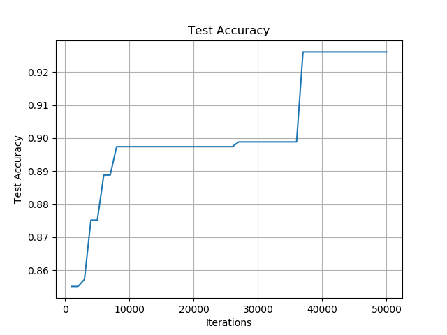

# Assignment#1 - Logistic Regression

## Jae Dong Hwang

### HAND IN:
Run your implementation on the training/test data in the framework and hand in a clear document containing the following.

#### Problem1.
Run for 50,000 iterations with step size 0.01 and plot the training set loss vs iteration every 1000 iterations.

#### Problem2.
Plot the test set loss, test set accuracy, and value of weight[1] after every 10,000 iterations.

#### Problem3.
Calculate all the statistics from the evaluation framework on the 50,000 iteration run, including the confusion matrix, precision, recall, etc.

|          |    1     |    0     |
|----------|----------|----------|
|    1     | (TP) 80  | (FN) 122 |
|    0     | (FP) 46  |(TN) 1146 |

Accuracy: 0.8794835007173601
Precision: 0.6349206349206349
Recall: 0.39603960396039606
FPR: 0.03859060402684564
FNR: 0.6039603960396039

#### Questions.
* What do these measurements tell you about logistic regression compared to the straw-men?

  * Heuristic model
    |          |    1     |    0     |
    |----------|----------|----------|
    |    1     | (TP) 168 | (FN) 34  |
    |    0     | (FP) 83  |(TN) 1109 |
    Accuracy: 0.9160688665710186
    Precision: 0.6693227091633466
    Recall: 0.8316831683168316
    FPR: 0.06963087248322147
    FNR: 0.16831683168316833

    The statistic outputs of logistic regression can can vary depending on the threshold, number of iteration, number of training data. Those configuration determines how fast the loss function can converge and how accurate it can predict output for test data.

* How did the gradient descent converge?
  * Weight[1] started from initial value, .05, and converged toward 2.6. The trend became more obvisous starting 20000 iteraions and later.
  
* What makes you think you implemented logistic regression correctly?
  * Both training and test loss function converges over iterations. 