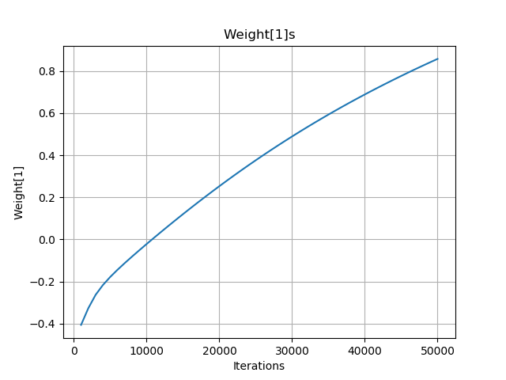

# Assignment#1 - Logistic Regression

## Jae Dong Hwang

* Structure of Ligistic Regression

  $\hat{y} = \frac{1}{1 + e^{-(w_0 + \sum_{i}^{n}w_i * x_i)}}$

* Loss function for Ligistic Regression  
  $Loss(\hat{y}, y) = -y*log(\hat{y})-(1-y) * log(1 - \hat{y})$

### Problem1.
Run for 50,000 iterations with step size 0.01 and plot the training set loss vs iteration every 1000 iterations.

### Problem2.
Plot the test set loss, test set accuracy, and value of weight[1] after every 10,000 iterations.

### Problem3.
Calculate all the statistics from the evaluation framework on the 50,000 iteration run, including the confusion matrix, precision, recall, etc.

### Questions.
* What do these measurements tell you about logistic regression compared to the straw-men?
* How did the gradient descent converge?
* What makes you think you implemented logistic regression correctly?