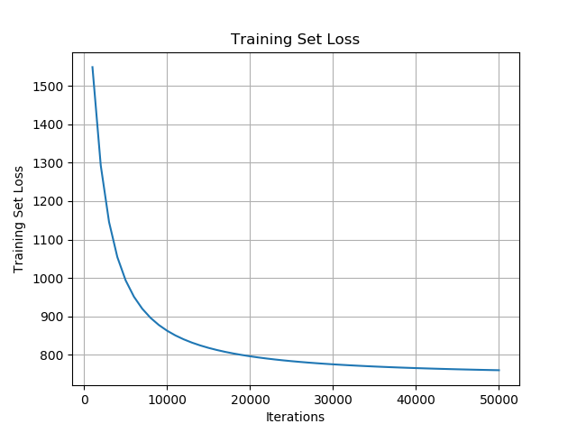
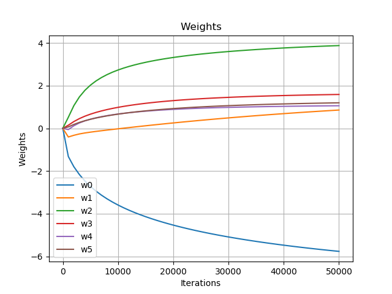

# Assignment#1 - Logistic Regression

## Jae Dong Hwang

### HAND IN:
Run your implementation on the training/test data in the framework and hand in a clear document containing the following.

#### Problem1.
Run for 50,000 iterations with step size 0.01 and plot the training set loss vs iteration every 1000 iterations.

#### Problem2.
Plot the test set loss, test set accuracy, and value of weight[1] after every 10,000 iterations.

  
  
  

#### Problem3.
Calculate all the statistics from the evaluation framework on the 50,000 iteration run, including the confusion matrix, precision, recall, etc.

|          |    1     |    0     |
|----------|----------|----------|
|    1     | (TP) 168 | (FN) 34  |
|    0     | (FP) 69  |(TN) 1123 |
Accuracy: 0.9261119081779053
Precision: 0.7088607594936709
Recall: 0.8316831683168316
FPR: 0.057885906040268456
FNR: 0.16831683168316833

#### Questions.
* What do these measurements tell you about logistic regression compared to the straw-men?

  * Most commom model

      |          |    1     |     0    |
      |----------|----------|----------|
      |    1     |  (TP) 0  | (FN) 202 |
      |    0     |  (FP) 0  |(TN) 1192 |
      ** Accuracy: 0.8550932568149211
      ** Precision: 0.0
      ** Recall: 0.0
      ** FPR: 1.0
      ** FNR: 0.0 

       * With the initial zeros weights, the accuracy of logistic regression(LR), began at one of most common model, 0.855093 and was always better (as shown the loss function converges).
       * Since the most common model has 0 for TP and FP, only thing we can compare with LR model is accuracy which is the lowest value of LR.
  
  * Heuristic model
    
      |          |    1     |    0     |
      |----------|----------|----------|
      |    1     | (TP) 168 | (FN) 34  |
      |    0     | (FP) 83  |(TN) 1109 |
      ** Accuracy: 0.9160688665710186
      ** Precision: 0.6693227091633466
      ** Recall: 0.8316831683168316
      ** FPR: 0.06963087248322147
      ** FNR: 0.16831683168316833

    *  I observed that the accuracy of logistic regression(LR) changes with steps and took quite lots of iterations, 37000, to be more accurate than heuristic. The LR model produced same true positives but higher true negative, which explains higher accuracy. 

    * Since LR and Heruistic has same number of TF and FN, we got both same statistics on Recall and FNR. 

    * With lower false positive(FP) and higher true negative(TN), LR models would more right when actual test data is false.
    

* How did the gradient descent converge?
  * The trend of weights became more obvisous starting 10000 iteraions and later. This behavior matches that loss function showing convergence obviously to the minimum values near 10000 iterations. 

  * Just to convince myself the weights converge to a certain values respectively, I plotted weights below.
  
  
* What makes you think you implemented logistic regression correctly?
  * Both training and test loss function converges over iterations and the accuracy increase over time.
