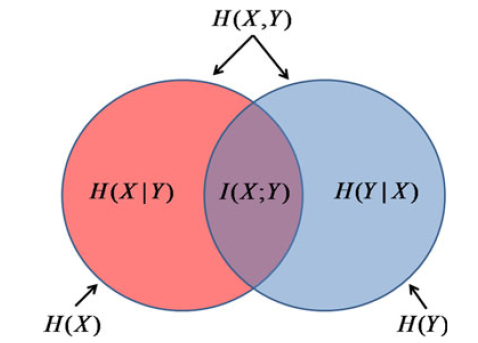
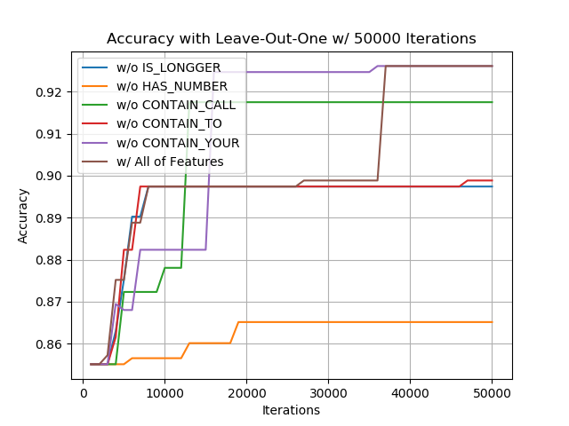

# Assignment#2. Feature Engineering

## Jae Dong Hwang

**Add bag of words features to your spam domain solution**

Support frequency based feature selection, top N
Support mutual information based features selection top N
Tokenize in the simplest way possible (by splitting on whitespace)

Recall:

MutiualInformation(X,Y) = Sum over every value X has and Y has:

            P(has X, has Y) * log_2 P(has X, has Y) / (P(has X) * P(has Y))

And use smoothing when calculating the probabilities:

P(*) = (# observed + 1) / (total samples + 2)


HAND IN:

A document that contains the following tables (clearly labeled!)

1 point -- Perform a leave-out-one wrapper search on each of the 5 features provided by the starting framework (50,000 iterations, there are 5 features, you can do this evaluation manually or programmatically). (> 40, contains #, contains ‘call’, contains ‘to’, contains ‘your’). Hand in a table showing the accuracy with each one left out, compared to a model built with all of them.

0.5 point -- A list of the top 10 bag of word features selected by filtering by frequency.
0.5 point -- A list of the top 10 bag of word features selected by filtering by mutual information.

2 points --

0.5 point -- Run gradient descent to 50,000 iterations with the top 10 words by frequency.
0.5 point -- Run gradient descent to 50,000 iterations with the top 10 words by mutual information.
0.5 point -- Run gradient descent to 50,000 iterations with the better of these PLUS the hand crafted features from the framework.
0.5 point -- Run gradient descent to 50,000 iterations of the previous setting with 100 words plus hand-crafted instead of 10.
Hand in a clearly labeled table comparing the accuracies of these methods

***

```python

for f in featureSelectionMethodsToTry:
    (trainX, trainY, fParameters) = FeaturizeTraining(rawTrainX, rawTrainY, f)
    (validationX, validationY) = FeaturizeValidation(rawValidationX, rawValidationY, f, fParameters)

for p in parametersToTry:
    model.fit(trainX, trainY, p)
    accuracies[p, f] = evaluate(validationY, model.predict(validationX))

(bestPFound, bestFFound) = bestSettingFound(accuracies)

(finalTrainX, finalTrainY, fParameters) =
    FeaturizeTraining(rawTrainX + rawValidationX, rawTrainY + rawValidationY, bestFFound)

(testX, testY) = FeaturizeValidation(rawTextX, rawTestY, bestFFound, fParameters)

finalModel.fit(finalTrainX, finalTrainY, bestPFound)

estimateOfGeneralizationPerformance = evaluate(testY, model.predict(testX))

```