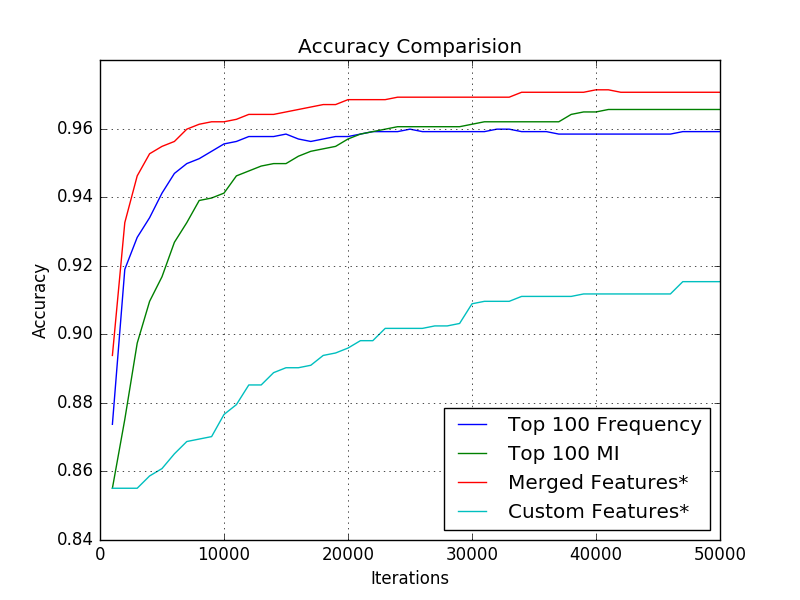

# Assignment#2. Feature Engineering

## Jae Dong Hwang

### SpamHeuristicModel with bag of word modification

* A table showing the accuracy with each one left out, compared to a model built with all of them.

  | Leave-out-Features | Accuracy           |
  | ------------------ | ------------------ |
  | w/o IS_LONGGER     | 0.8895265423242468 |
  | w/o HAS_NUMBER     | 0.857245337159254  |
  | w/o CONTAIN_CALL   | 0.8938307030129125 |
  | w/o CONTAIN_TO     | 0.8974175035868006 |
  | w/o CONTAIN_YOUR   | 0.9167862266857962 |
  | w/ All of Features | 0.8931133428981348 |

* A list of the top 10 bag of word features selected by filtering by frequency.
  
  | Features | Frequency |
  | :------: | :-------: |
  | to       | 1586      |
  | you      | 1174      |
  | I        | 1099      |
  | a        | 993       |
  | the      | 890       |
  | and      | 629       |
  | is       | 592       |
  | in       | 586       |
  | i        | 558       |
  | u        | 542       |

* A list of the top 10 bag of word features selected by filtering by mutual information.

  | Features | Mutual Information    |
  | -------- | --------------------- |
  | I        | 0.0037431778649602105 |
  | Call     | 0.0025203798599061087 |
  | i        | 0.002356358770874558  |
  | FREE     | 0.0022381150276038434 |
  | claim    | 0.0019205695585422415 |
  | &        | 0.0018018071141155463 |
  | my       | 0.0016577371208125879 |
  | mobile   | 0.00164062330676438   |
  | To       | 0.0016346171629362423 |
  | Txt      | 0.0015661937627271662 |

### Gradient descent to 50,000 iterations

* Run gradient descent to 50,000 iterations with the top 10 words by frequency.
* Run gradient descent to 50,000 iterations with the top 10 words by mutual information.
* Run gradient descent to 50,000 iterations with the better of these PLUS the hand crafted features from the framework.
* Run gradient descent to 50,000 iterations of the previous setting with 100 words plus hand-crafted instead of 10.

#### N = 10

  Below is the results from 50,000 iteration with different configurations. Merged features is the one that combined top 10 frequency into top 10 mutual information. I also chose three additional words(features) and ran model with top 10 features. The accuracies over iteration was plotted below.

  | Configurations   | Accuracy           |
  | ---------------- | ------------------ |
  | Top 10 Frequency | 0.8550932568149211 |
  | Top 10 MI        | 0.9239598278335724 |
  | Merged Features* | 0.9246771879483501 |
  | Custom Features* | 0.9153515064562411 |

* Merged Features selected:
  ['I', 'in', 'u', 'Call', 'To', 'the', 'my', 'Txt', 'to', 'is', 'you', 'FREE', 'a', 'claim', 'mobile', 'i', 'and', '&']

* Custom Features selected:
  ['I', 'Call', 'i', 'Free', 'claim', 'to', 'you', 'a', 'the', 'and', 'prize', 'www.', 'customer']

#### N = 100

With N=100, I got much better accuracy as expected. The custom features below is the results from the custom case with N=10 and plotted to make the comparision easier between N=100 and N=10 (see plot below).

|        Configurations        |           Accuracy           |
|------------------------------|------------------------------|
|      Top 100 Frequency       |      0.9591104734576757      |
|          Top 100 MI          |      0.9655667144906743      |
|       Merged Features*       |      0.9705882352941176      |
|       Custom Features*       |      0.9153515064562411      |

