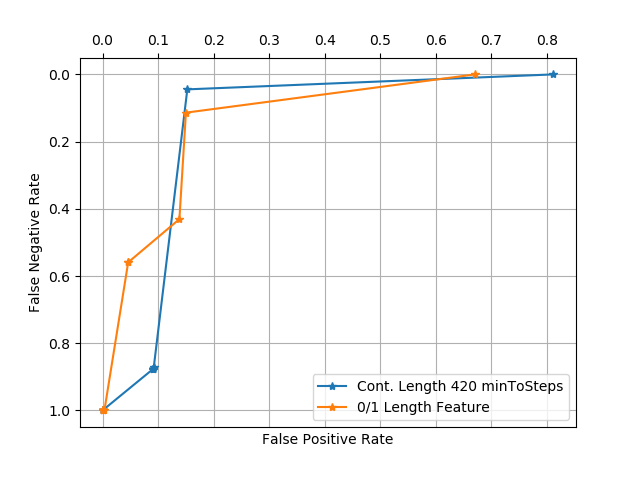

# Homework3. Problem 2

## Jae Dong Hwang

### Decision Tree

#### Part 1.Run your DecisionTree algorithm on the SMS spam dataset (with the train/test split provided in the sample framework) using just the heuristic hand crafted features that were included with the initial framework and with minToSplit = 100 (no additional text features).

**Report the accuracy on the hold out set. Include an error bound.**

**Include a visualization of the tree.**

* Before changing feature selections
  * Accuracy: 0.9261119081779053, Lower: 0.9181816579663119, Upper: 0.9340421583894988
  * Decision Tree with minToStop=100
Feature 1: 
...,>= 0.5:
...,...,Leaf: 515 vs 574
...,< 0.5:
...,Feature 2: 
...,...,>= 0.5:
...,...,...,Leaf: 156 vs 26
...,...,< 0.5:
...,...,Feature 0: 
...,...,...,>= 0.5:
...,...,...,...,Leaf: 156 vs 23
...,...,...,< 0.5:
...,...,...,Feature 4: 
...,...,...,...,>= 0.5:
...,...,...,...,...,Leaf: 51 vs 5
...,...,...,...,< 0.5:
...,...,...,...,[1]
...,...,...,...,Feature 3: 
...,...,...,...,...,>= 0.5:
...,...,...,...,...,...,Leaf: 63 vs 11
...,...,...,...,...,< 0.5:
...,...,...,...,...,[1]
...,...,...,...,...,[1]
...,...,...,[0]
...,...,Feature 3: 
...,...,...,>= 0.5:
...,...,...,...,Leaf: 267 vs 214
...,...,...,< 0.5:
...,...,...,Feature 4: 
...,...,...,...,>= 0.5:
...,...,...,...,...,Leaf: 58 vs 13
...,...,...,...,< 0.5:
...,...,...,...,[1]
...,...,...,...,Feature 0: 
...,...,...,...,...,>= 0.5:
...,...,...,...,...,...,Leaf: 207 vs 180
...,...,...,...,...,< 0.5:
...,...,...,...,...,Feature 0: 
...,...,...,...,...,...,>= 0.5:
...,...,...,...,...,...,...,Leaf: 207 vs 180
...,...,...,...,...,...,< 0.5:
...,...,...,...,...,...,[1]
...,...,...,...,...,...,[1]
...,...,...,...,...,[0]
...,...,...,Feature 4: 
...,...,...,...,>= 0.5:
...,...,...,...,...,Leaf: 12 vs 5
...,...,...,...,< 0.5:
...,...,...,...,[1]
...,...,...,...,Feature 0: 
...,...,...,...,...,>= 0.5:
...,...,...,...,...,...,Leaf: 76 vs 264
...,...,...,...,...,< 0.5:
...,...,...,...,...,Feature 0: 
...,...,...,...,...,...,>= 0.5:
...,...,...,...,...,...,...,Leaf: 76 vs 264
...,...,...,...,...,...,< 0.5:
...,...,...,...,...,...,[0]
...,...,...,...,...,...,[0]
...,...,...,...,...,[0]
...,Feature 0: 
...,...,>= 0.5:
...,...,...,Leaf: 29 vs 1871
...,...,< 0.5:
...,...,Feature 3: 
...,...,...,>= 0.5:
...,...,...,...,Leaf: 21 vs 848
...,...,...,< 0.5:
...,...,...,Feature 4: 
...,...,...,...,>= 0.5:
...,...,...,...,...,Leaf: 6 vs 104
...,...,...,...,< 0.5:
...,...,...,...,Feature 2: 
...,...,...,...,...,>= 0.5:
...,...,...,...,...,...,Leaf: 0 vs 6
...,...,...,...,...,< 0.5:
...,...,...,...,...,[0]
...,...,...,...,...,Feature 0: 
...,...,...,...,...,...,>= 0.5:
...,...,...,...,...,...,...,Leaf: 6 vs 98
...,...,...,...,...,...,< 0.5:
...,...,...,...,...,...,[0]
...,...,...,...,...,...,[0]
...,...,...,...,Feature 2: 
...,...,...,...,...,>= 0.5:
...,...,...,...,...,...,Leaf: 0 vs 40
...,...,...,...,...,< 0.5:
...,...,...,...,...,[0]
...,...,...,...,...,Feature 0: 
...,...,...,...,...,...,>= 0.5:
...,...,...,...,...,...,...,Leaf: 15 vs 704
...,...,...,...,...,...,< 0.5:
...,...,...,...,...,...,[0]
...,...,...,...,...,...,[0]
...,...,...,Feature 4: 
...,...,...,...,>= 0.5:
...,...,...,...,...,Leaf: 2 vs 95
...,...,...,...,< 0.5:
...,...,...,...,[0]
...,...,...,...,Feature 2: 
...,...,...,...,...,>= 0.5:
...,...,...,...,...,...,Leaf: 0 vs 41
...,...,...,...,...,< 0.5:
...,...,...,...,...,[0]
...,...,...,...,...,Feature 0: 
...,...,...,...,...,...,>= 0.5:
...,...,...,...,...,...,...,Leaf: 6 vs 887
...,...,...,...,...,...,< 0.5:
...,...,...,...,...,...,[0]
...,...,...,...,...,...,[0]
...,...,Feature 3: 
...,...,...,>= 0.5:
...,...,...,...,Leaf: 0 vs 219
...,...,...,< 0.5:
...,...,...,Feature 0: 
...,...,...,...,>= 0.5:
...,...,...,...,...,Leaf: 0 vs 219
...,...,...,...,< 0.5:
...,...,...,...,[0]
...,...,...,...,[0]
...,...,...,Feature 2: 
...,...,...,...,>= 0.5:
...,...,...,...,...,Leaf: 0 vs 64
...,...,...,...,< 0.5:
...,...,...,...,[0]
...,...,...,...,Feature 4: 
...,...,...,...,...,>= 0.5:
...,...,...,...,...,...,Leaf: 0 vs 34
...,...,...,...,...,< 0.5:
...,...,...,...,...,[0]
...,...,...,...,...,Feature 0: 
...,...,...,...,...,...,>= 0.5:
...,...,...,...,...,...,...,Leaf: 1 vs 873
...,...,...,...,...,...,< 0.5:
...,...,...,...,...,...,[0]
...,...,...,...,...,...,[0]

#### Use cross validation to try a few values of minToSplit on this new training set. Then when you’ve selected a value for minToSplit:

**Describe what values of minToSplit you tried and which one turned out to be best.**

**Produce an ROC curve comparing this version (the continuous length and tuned minToSplit) to the original version (from above, with a 0/1 length feature with threshold 40 and minToSplit = 100). Clearly label which curve corresponds to which model.**

**NOTE to produce an ROC curve you need to use a threshold for predicting 1/0 based on the fraction of samples at the leaf with the predicted label.**

**Produce a visualization of the updated model.**

* I generated the below graph to see the trend of accuracies over range of minToStops. Using k=5, the accuracy reached between 400 minToStop and started dropping soon after 700.
  

* ROC curve was generated as below.
  

* Best accuracy 0.9232424677187948 with MinToStop 420
* Model visualization with min to stop 420
Feature 1: 
...,>= 0.5:
...,...,Leaf: 515 vs 574
...,< 0.5:
...,Feature 2: 
...,...,>= 0.5:
...,...,...,Leaf: 156 vs 26
...,...,< 0.5:
...,...,[1]
...,...,Feature 3: 
...,...,...,>= 0.5:
...,...,...,...,Leaf: 267 vs 214
...,...,...,< 0.5:
...,...,...,Feature 4: 
...,...,...,...,>= 0.5:
...,...,...,...,...,Leaf: 58 vs 13
...,...,...,...,< 0.5:
...,...,...,...,[1]
...,...,...,...,[1]
...,...,...,Feature 4: 
...,...,...,...,>= 0.5:
...,...,...,...,...,Leaf: 12 vs 5
...,...,...,...,< 0.5:
...,...,...,...,[1]
...,...,...,...,[0]
...,Feature 3: 
...,...,>= 0.5:
...,...,...,Leaf: 21 vs 1067
...,...,< 0.5:
...,...,Feature 4: 
...,...,...,>= 0.5:
...,...,...,...,Leaf: 6 vs 112
...,...,...,< 0.5:
...,...,...,[0]
...,...,...,Feature 2: 
...,...,...,...,>= 0.5:
...,...,...,...,...,Leaf: 0 vs 45
...,...,...,...,< 0.5:
...,...,...,...,[0]
...,...,...,...,Feature 0: 
...,...,...,...,...,>= 0.5:
...,...,...,...,...,...,Leaf: 0 vs 5
...,...,...,...,...,< 0.5:
...,...,...,...,...,[0]
...,...,...,...,...,Feature 0: 
...,...,...,...,...,...,>= 0.5:
...,...,...,...,...,...,...,Leaf: 0 vs 37
...,...,...,...,...,...,< 0.5:
...,...,...,...,...,...,[0]
...,...,...,...,...,...,Feature 0: 
...,...,...,...,...,...,...,>= 0.5:
...,...,...,...,...,...,...,...,Leaf: 11 vs 288
...,...,...,...,...,...,...,< 0.5:
...,...,...,...,...,...,...,[0]
...,...,...,...,...,...,...,Feature 0: 
...,...,...,...,...,...,...,...,>= 0.5:
...,...,...,...,...,...,...,...,...,Leaf: 4 vs 399
...,...,...,...,...,...,...,...,< 0.5:
...,...,...,...,...,...,...,...,[0]
...,...,...,...,...,...,...,...,[0]
...,...,Feature 4: 
...,...,...,>= 0.5:
...,...,...,...,Leaf: 2 vs 133
...,...,...,< 0.5:
...,...,...,[0]
...,...,...,Feature 0: 
...,...,...,...,>= 0.5:
...,...,...,...,...,Leaf: 3 vs 86
...,...,...,...,< 0.5:
...,...,...,...,[0]
...,...,...,...,Feature 0: 
...,...,...,...,...,>= 0.5:
...,...,...,...,...,...,Leaf: 2 vs 356
...,...,...,...,...,< 0.5:
...,...,...,...,...,[0]
...,...,...,...,...,Feature 0: 
...,...,...,...,...,...,>= 0.5:
...,...,...,...,...,...,...,Leaf: 2 vs 887
...,...,...,...,...,...,< 0.5:
...,...,...,...,...,...,Feature 2: 
...,...,...,...,...,...,...,>= 0.5:
...,...,...,...,...,...,...,...,Leaf: 0 vs 36
...,...,...,...,...,...,...,< 0.5:
...,...,...,...,...,...,...,[0]
...,...,...,...,...,...,...,Feature 0: 
...,...,...,...,...,...,...,...,>= 0.5:
...,...,...,...,...,...,...,...,...,Leaf: 2 vs 851
...,...,...,...,...,...,...,...,< 0.5:
...,...,...,...,...,...,...,...,[0]
...,...,...,...,...,...,...,...,[0]
...,...,...,...,...,...,Feature 0: 
...,...,...,...,...,...,...,>= 0.5:
...,...,...,...,...,...,...,...,Leaf: 0 vs 477
...,...,...,...,...,...,...,< 0.5:
...,...,...,...,...,...,...,[0]
...,...,...,...,...,...,...,[0]

***