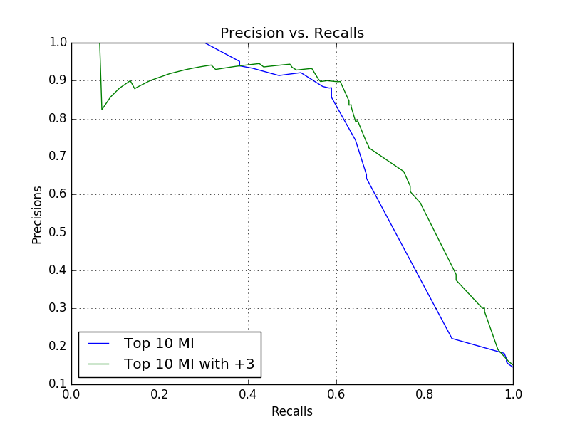

# Homework3. Problem 1

## Jae Dong Hwang

### PR Curve

#### Produce a chart that compares a:

* logistic regression model with 10 mutual information features
* logistic regression model with 10 mutual information features and my heuristic features

### FPR and FNR

#### Hand in a table that contains the threshold that achieve 10% False Positive Rate on the test set for these two model (10 mutual information features with and without heuristics). Include the False Negative Rate that is achieved on the test set by that threshold.

* Here is the summary of the table for false positive rate and false negative rate when thershold is about 10%.

  |Thresholds|False Positive Rates | False Negative Rates |
  |-|-|-|
  |0.108 | 0.06040268456375839 | 0.3316831683168317 |

  * Below is the partial log that contains data from begining to 0.108(10%) threshold.

    **Thresholds,False Positive Rates**
    *0.01,0.9966442953020134*
    *0.019799999999999998,0.9286912751677853*
    *0.0296,0.8842281879194631*
    *0.0394,0.8288590604026845*
    *0.0492,0.7483221476510067*
    *0.059000000000000004,0.7483221476510067*
    *0.0688,0.5151006711409396*
    *0.07859999999999999,0.5125838926174496*
    *0.08839999999999999,0.06291946308724833*
    *0.0982,0.06040268456375839*
    *0.108,0.06040268456375839*
    *...*

    **Thresholds,False Negative Rates**
    *0.01,0.0*
    *0.019799999999999998,0.009900990099009901*
    *0.0296,0.01485148514851485*
    *0.0394,0.01485148514851485*
    *0.0492,0.019801980198019802*
    *0.059000000000000004,0.019801980198019802*
    *0.0688,0.13861386138613863*
    *0.07859999999999999,0.13861386138613863*
    *0.08839999999999999,0.3316831683168317*
    *0.0982,0.3316831683168317*
    *0.108,0.3316831683168317*
    *...*

  * Below is the graph that shows the FPR and FNR over the range of thresholds.
    

    