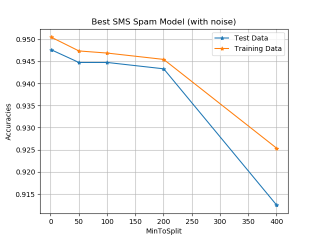
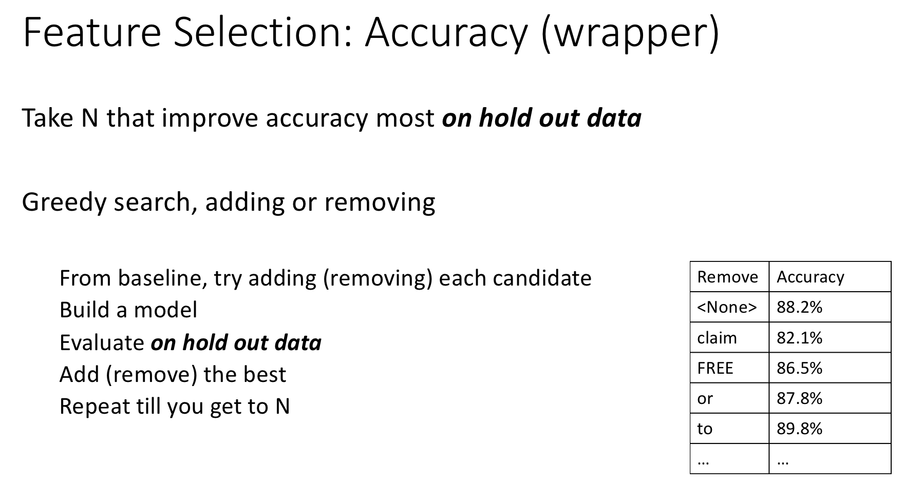

# Homework4. Problem 2 Build your Best SMS Spam Model

## Jae Dong Hwang

### Build the Best SMS Spam Model

* Use the same version of the data used by the RandomForest assignment (with the calls to AddNoise.MakeProblemHarder).

* Use the three algorithms you’ve implemented.

* Use the featuring engineering you’ve implemented.

#### A report of no more than 1000 words with no more than 5 figures/tables which demonstrates that you have produced an effective model for the harder SMS problem (with added noise) and properly evaluated your model.

##### Demonstrate several parameter sweeps in your figures and highlight at least one area that indicates underfitting and one that indicates overfitting.

##### Make sure to use the appropriate techniques from the previous lectures (error bounds, various measures of model quality, categorized mistakes).

##### Examine your mistakes and improve your feature engineering in at least 3 ways. Describe the features your best model uses.

##### Include an ROC curve comparing the first model you tried with your final best model. Clearly label what they are.

##### Describe your best model and parameter settings. Include the estimate of the accuracy your best model achieves using cross validation on the training data and the estimate you get on the hold-out test set.

For the model bagged with three base learners, Logistic Regression, Decision Tree, and Random Forests, I chose parameters below:

```python
# Example of parameters with default value
config = {
    'num_iteration': 10000,  # logistic regression
    'min_to_stop': 100,  # decision tree and random forest
    'feature_restriction': 20,  # random forest
    'use_bagging': True,  # random forest.
    'num_trees': 40,  # random forest
    'feature_restriction': 20,  # random forest
    'feature_selection_by_mi': 20,  # 0 means False, N > 0 means select top N words based on mi.
    'feature_selection_by_frequency': 10  # 0 means False, N > 0 means select top N words based on frequency.
}
```
Firstly, I predicted model by sweeping min_to_stop(minToSplit). Below graph indiciates as increasing the **overfitting** **underfitting**

The number of mutual information words can decrease accruacy (overfitting - )



* Feature Selection Improvement by 
  1. number of frequency
  2. mutual information
  3. accuracy
   

* Catagory Mistakes
  * Here are top 20 words found as a category mistakes.
    1. FPR
    2. FNR


* Improvement
  * Determine words to add using category mistakes. This will be included in feature selection.

  * Compare with ROC curves. The default configuration vs Best Configuration (with improvement items)
    *  Here is the best configuration setting. I decided to use them ...
    *  Accuracy Estimate based on the *cross validation* is ...