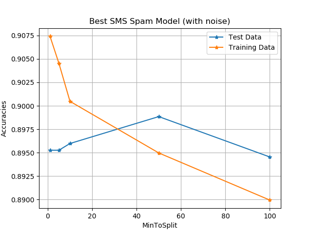

# Homework4. Problem 2 Build your Best SMS Spam Model

## Jae Dong Hwang

### Build the Best SMS Spam Model

#### Baseline configuration and Parameter Sweeps
The SMS spam model described here packages three base leaners, *Logistic Regression, Decision Tree, and Random Forests* developed through previous assignments. When it comes to voting the prediction, I equally weighted the results from the models. The baseline configuration was carefully chosen based on the previous assignments.

```python
# Example of parameters with default value
config = {
    'name': 'Baseline',
    'num_iteration': 10000,                # logistic regression
    'min_to_stop': 100,                    # decision tree and random forest
    'bagging_w_replacement': True,         # random forest (bootstrapping)
    'num_trees': 20,                       # random forest
    'feature_restriction': 20,             # random forest
    'feature_selection_by_mi': 20,         # 0 means False, N > 0 means select top N words based on mi.
    'feature_selection_by_frequency': 10,   # 0 means False, N > 0 means select top N words based on frequency.
    'include_handcrafted_features': False
}
```
With the parameters above, the model was thought, and the accuracies were collected with three parameter sweeps. Below is the accuracies over various min_to_stop(/split). It shows the comparison between what model predict based on training versus how it performs on the hold-out data(test). We can see the two lines are close over around minToStop(minToSplit) 40. It indicates the model is *overfitting* data with too much search to fit training data. 


With the same configuration, the parameter sweep by mutual information showed *underfitting* behavior. The model predicts the accuracy increases overall. But it turned out the accuracy decreased in between 50 and 200. 


#### Category Mistakes for Feature Engineering Improvement

The common category mistakes were collected to determine the features that cause the accuracy loss. The last part of this report contains the detailed lists for false negative and positive cases. Given the list, I developed a script that gives me the candidate heuristic features that would reduce the bad false positives and negative. And here are the rules found:

  * If a message contains URL starting with www or HTTP, or upper case words, consider it as a spam.
  * If a message contains many consecutive dots or lower 'i' in the place of 'I', consider it as not a spam.

I also investigate the accuracies to understand the impact of the heuristic features found in mistakes. 

| Leave-out-Features | Accuracy(w/o Noise)    |
|--------------------|--------------------|
|  w/o MANY_UPPERS   | 0.9325681492109039 |
|    w/o HAS_URL     | 0.9325681492109039 |
| w/ All of Features | 0.9512195121951219 |

At this point, I improved the model by adding top features by the number of frequency and mutual information. The table below contains the comparison between without and with handcrafted features based on the words. Addition to the heuristic rules based on FP, FN cases, and leave-one-out accuracy table.


| Without Handcrafted Features | With Handcrafted Features|
|-|-|
| | |
| | |

#### Model comparison ROC curves
Based on the simulation and comparisons, I updated the baseline configuration like below. I decided to use 40 trees for the random forest, 100 feature restriction within 250 features selected by mutual information and four handcrafted ones. It excludes the features chosen by frequency as there are many overlaps found one by mutual information.

```python

config = {
        'name': 'Improved',
        'iterations': 10000,  # logistic regression
        'min_to_stop': 2,  # decision tree and random forest
        'bagging_w_replacement': True,  # random forest.
        'num_trees': 40,  # random forest
        'feature_restriction': 100,  # random forest
        'feature_selection_by_mi': 250,  # 0 means False, N > 0 means select top N words based on mi.
        'feature_selection_by_frequency': 0,  # 0 means False, N > 0 means select top N words based on frequency.
        'include_handcrafted_features': True
    }
```
Below is the ROC curve comparisons between baseline and updated configurations. 


#### Accuracy Estimate by Cross Validation

Using the *improved* configuration above, I estimated the accuracy using cross-validation(k=5). This process took hours to generate the results. There are potential to improve the overall performance with more trials and parameter sweeps. But here is the final results generated throughout the process above.


#### Conclusion
This report demonstrated the processes and technics used to improve the accuracy of SMS spam model. The noise made hard to improve the performance and especially when selecting features to add/remove. The parameter sweeping helped to identify parameters to calibrate and its directions. Category mistakes improved the feature selection by the list of worst examples. Leave-out accuracy technic could be used to tune the feature selection. Finally, the ROC comparison shows the two configurations (baseline and improved) predicts the different classification depending on the thresholds targeted. The accuracy estimated with cross-validation and comparison it with on hold-out data showed the potential range of prediction accuracies. 
***


#### Appendix. 

######List of False Negative by top 20 mutual information.

* False Negative - the true answer was 1, but gives very low probabilities

  | Probabilities | Test Raw |
  |-|-|
  |     0.00462714257933331      | Did you hear about the new "Divorce Barbie"? It comes with all of Ken's stuff!|
  |     0.006165287644810547     | SMS. ac Sptv: The New Jersey Devils and the Detroit Red Wings play Ice Hockey. Correct or Incorrect? End? Reply END SPTV|
  |     0.008590455265827307     | You have an important customer service announcement from PREMIER.|
  |     0.01577934164229301      | Hello. We need some posh birds and chaps to user trial prods for champneys. Can i put you down? I need your address and dob asap. Ta r|
  |     0.020790202830154716     | Filthy stories and GIRLS waiting for your|
  |     0.021152368341531374     | Reminder: You have not downloaded the content you have already paid for. Goto http://doit. mymoby. tv/ to collect your content.|
  |     0.035205607542868396     | Your credits have been topped up for http://www.bubbletext.com Your renewal Pin is tgxxrz|
  |     0.04932013248498171      | Hi I'm sue. I am 20 years old and work as a lapdancer. I love sex. Text me live - I'm i my bedroom now. text SUE to 89555. By TextOperator G2 1DA 150ppmsg 18+|
  |     0.05105911204739083      | SMS. ac Blind Date 4U!: Rodds1 is 21/m from Aberdeen, United Kingdom. Check Him out http://img. sms. ac/W/icmb3cktz8r7!-4 no Blind Dates send HIDE|
  |     0.05268142971603876      | FreeMsg Why haven't you replied to my text? I'm Randy, sexy, female and live local. Luv to hear from u. Netcollex Ltd 08700621170150p per msg reply Stop to end|
  |     0.06650378152611856      | Someone U know has asked our dating service 2 contact you! Cant Guess who? CALL 09058091854 NOW all will be revealed. PO BOX385 M6 6WU|
  |     0.07862064560985564      | <Forwarded from 448712404000>Please CALL 08712404000 immediately as there is an urgent message waiting for you.|
  |     0.07862064560985564      | Please CALL 08712402779 immediately as there is an urgent message waiting for you|
  |     0.07974437718670567      | FreeMsg Hey there darling it's been 3 week's now and no word back! I'd like some fun you up for it still? Tb ok! XxX std chgs to send, £1.50 to rcv|
  |     0.07974437718670567      | Hey I am really horny want to chat or see me naked text hot to 69698 text charged at 150pm to unsubscribe text stop 69698|
  |     0.07974437718670567      | Talk sexy!! Make new friends or fall in love in the worlds most discreet text dating service. Just text VIP to 83110 and see who you could meet.|
  |     0.07974437718670567      | I don't know u and u don't know me. Send CHAT to 86688 now and let's find each other! Only 150p/Msg rcvd. HG/Suite342/2Lands/Row/W1J6HL LDN. 18 years or over.|
  |     0.08339251430910777      | Are you unique enough? Find out from 30th August. www.areyouunique.co.uk|
  |     0.08339251430910777      | 100 dating service cal;l 09064012103 box334sk38ch|
  |     0.08339251430910777      | U were outbid by simonwatson5120 on the Shinco DVD Plyr. 2 bid again, visit sms. ac/smsrewards 2 end bid notifications, reply END OUT|

######List of False Positive by top 20 mutual information.

* False Positive - the true answer was 0, but gives very high probabilities

  | Probabilities | Test Raw |
  |-|-|
  |      0.9099370421160753      | Can you call me plz. Your number shows out of coveragd area. I have urgnt call in vasai &amp; have to reach before 4'o clock so call me plz|
  |      0.9075682316254134      | Yun ah.the ubi one say if ü wan call by tomorrow.call 67441233 look for irene.ere only got bus8,22,65,61,66,382. Ubi cres,ubi tech park.6ph for 1st 5wkg days.èn|
  |      0.8704018588177599      | Hmmm.. Thk sure got time to hop ard... Ya, can go 4 free abt... Muz call u to discuss liao...|
  |      0.8469374085690141      | Ups which is 3days also, and the shipping company that takes 2wks. The other way is usps which takes a week but when it gets to lag you may have to bribe nipost to get your stuff.|
  |      0.8427587223279254      | 1.20 that call cost. Which i guess isnt bad. Miss ya, need ya, want ya, love ya|
  |      0.8427587223279254      | Was actually sleeping and still might when u call back. So a text is gr8. You rock sis. Will send u a text wen i wake.|
  |      0.789003286326731       | is your hamster dead? Hey so tmr i meet you at 1pm orchard mrt?|
  |      0.729033750524799       | Nothing. I meant that once the money enters your account here, the bank will remove its flat rate. Someone transfered  &lt;#&gt;  to my account and  &lt;#&gt; dollars got removed. So the banks differ and charges also differ.be sure you trust the 9ja person you are sending account details to cos...|
  |      0.5044991277544608      | Book which lesson? then you msg me... I will call up after work or sth... I'm going to get specs. My membership is PX3748|

  ***
