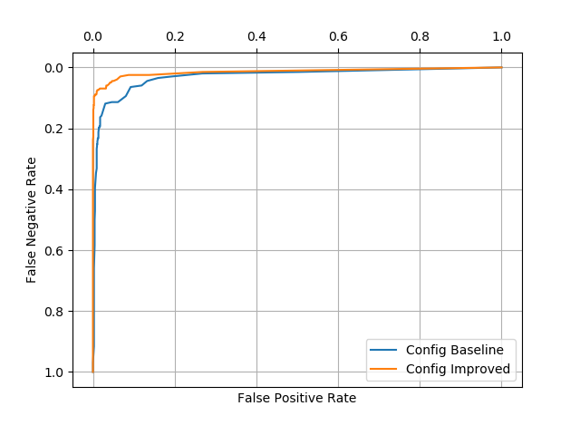

# Homework4. Problem 2 Build your Best SMS Spam Model

## Jae Dong Hwang

### Build the Best SMS Spam Model

#### Baseline configuration and Parameter Sweeps
The SMS spam model described here packages three base leaners, *Logistic Regression, Decision Tree, and Random Forests* developed through previous assignments. When it comes to voting the prediction, I equally weighted the results from the models. The baseline configuration was carefully chosen based on the previous assignments.

```python
# Example of parameters with default value
config = {
    'name': 'Baseline',
    'num_iteration': 10000,                # logistic regression
    'min_to_stop': 100,                    # decision tree and random forest
    'bagging_w_replacement': True,         # random forest (bootstrapping)
    'num_trees': 20,                       # random forest
    'feature_restriction': 20,             # random forest
    'feature_selection_by_mi': 20,         # 0 means False, N > 0 means select top N words based on mi.
    'feature_selection_by_frequency': 10,   # 0 means False, N > 0 means select top N words based on frequency.
    'include_handcrafted_features': False
}
```
The model was thought, and the accuracies were collected with three parameter sweeps. Below is the accuracies over various min_to_stop(/split). It shows the comparison between what model predict based on training versus how it performs on the hold-out data(test). We can see the two lines are close over around minToStop(minToSplit) 40. It indicates the model is *overfitting* data with too much search to fit training data. 


With the same configuration, the parameter sweep by mutual information showed *underfitting* behavior. The model predicts the accuracy increases overall. But it turned out the accuracy decreased in between 100 and 200. 

| | |
|-|-|
| overfitting before minToSplit = 40| underfitting between 100 and 200|


#### Category Mistakes for Feature Engineering Improvement

The common category mistakes were collected to determine the features that cause the accuracy loss. The [Appendix A](#appendix-a) of this report contains the detailed lists for false negative and positive cases. Given the list, I developed a script that gives me the candidate heuristic features that would reduce the bad false positives and negative. And here are the rules found:

  * If a message contains URL starting with www or HTTP, or upper case words, consider it as a spam.
  * If a message contains many consecutive dots or lower 'i' in the place of 'I', consider it as not a spam.

I also investigate the accuracies to understand the impact of the heuristic features found in mistakes. The accuracy got increased with additional heuristic features whether or not the input data contains the noise provided in an assignment.  

| Leave-out-Features | Accuracy(w/o Noise)    |
|--------------------|--------------------|
|  w/o MANY_UPPERS   | 0.9325681492109039 |
|    w/o HAS_URL     | 0.9325681492109039 |
| w/ All of Features | 0.9512195121951219 |

At this point, I improved the model by adding top features by the number of frequency and mutual information. The table below contains the comparison between without and with handcrafted features based on the words. Addition to the heuristic rules based on FP, FN cases, and leave-one-out accuracy table.


| Without Handcrafted Features | With Handcrafted Features|
|-|-|
| | |
| | |

#### Model comparison ROC curves
Based on the simulation and comparisons, I updated the baseline configuration like below. I decided to use 40 trees for the random forest, 100 feature restriction within 250 features selected by mutual information and four handcrafted ones. It excludes the features chosen by frequency as there are many overlaps found one by mutual information.

```python

config = {
        'name': 'Improved',
        'iterations': 10000,  # logistic regression
        'min_to_stop': 2,  # decision tree and random forest
        'bagging_w_replacement': True,  # random forest.
        'num_trees': 40,  # random forest
        'feature_restriction': 100,  # random forest
        'feature_selection_by_mi': 250,  # 0 means False, N > 0 means select top N words based on mi.
        'feature_selection_by_frequency': 0,  # 0 means False, N > 0 means select top N words based on frequency.
        'include_handcrafted_features': True
    }
```
Below is the ROC curve comparisons between baseline and updated configurations. Without noise, it's obvious the improved configuration shows more AUC (Area Under The Curve). With noise, it's not intuitive but improved configuration is slightly better than baseline configuration.

| W/O Noise | W/ Noise |
|-|-|
|||


#### Accuracy Estimate by Cross Validation

Using the *improved* configuration above, I estimated the accuracy using cross-validation(k=5). This process took hours to generate the results. There are potential to improve the overall performance with more trials and parameter sweeps. But here is the final results generated throughout the process above.

* Overall Accuracy w/ noise: 0.8952153110047847
* Overall Accuracy w/o noise: 0.9822966507177033
* Accuracy Estimate Comparison: 
  
  |            Cases             |           Accuracy           |            Upper             |            Lower             |
  |------------------------------|------------------------------|------------------------------|------------------------------|
  |        Training Data (w/ noise)         |      0.8952153110047847      |      0.9045002829432074      |      0.885930339066362       |
  |        Hold-out Data (w/ noise)        |      0.9031563845050216      |      0.912122099020048       |      0.8941906699899951      |
  |        Training Data (w/o noise)        |      0.9822966507177033      |      0.9862944131366549      |      0.9782988882987518      |
  |        Hold-out Data (w/o noise)        |      0.9813486370157819      |      0.9854500630081059      |      0.9772472110234579      |
The confusion matrix and accuracies on each folded dataset are added in [Appendix B](#appendix-b).

#### Conclusion
This report documented the processes and technics used to improve the accuracy of SMS spam model. The noise given made hard to improve the performance and especially when selecting features to add/remove. The parameter sweeping helped to identify parameters to calibrate and its directions. Category mistakes drived the feature selection by the list of worst examples. Leave-out accuracy approach could be used to tune the feature selection if more time and computing resources were available. Finally, the ROC comparison shows the two configurations (baseline and improved) and demonstrated the improved model performs better. The accuracy estimated via cross-validation and comparison it with on hold-out data showed the potential range of prediction accuracies. 
***


#### <a name="appendix-a">Appendix A</a>

#####List of False Negative by top 20 mutual information.

* False Negative - the true answer was 1, but gives very low probabilities

  | Probabilities | Test Raw |
  |-|-|
  |     0.00462714257933331      | Did you hear about the new "Divorce Barbie"? It comes with all of Ken's stuff!|
  |     0.006165287644810547     | SMS. ac Sptv: The New Jersey Devils and the Detroit Red Wings play Ice Hockey. Correct or Incorrect? End? Reply END SPTV|
  |     0.008590455265827307     | You have an important customer service announcement from PREMIER.|
  |     0.01577934164229301      | Hello. We need some posh birds and chaps to user trial prods for champneys. Can i put you down? I need your address and dob asap. Ta r|
  |     0.020790202830154716     | Filthy stories and GIRLS waiting for your|
  |     0.021152368341531374     | Reminder: You have not downloaded the content you have already paid for. Goto http://doit. mymoby. tv/ to collect your content.|
  |     0.035205607542868396     | Your credits have been topped up for http://www.bubbletext.com Your renewal Pin is tgxxrz|
  |     0.04932013248498171      | Hi I'm sue. I am 20 years old and work as a lapdancer. I love sex. Text me live - I'm i my bedroom now. text SUE to 89555. By TextOperator G2 1DA 150ppmsg 18+|
  |     0.05268142971603876      | FreeMsg Why haven't you replied to my text? I'm Randy, sexy, female and live local. Luv to hear from u. Netcollex Ltd 08700621170150p per msg reply Stop to end|
  |      0.1319347188456733      | 08714712388 between 10am-7pm Cost 10p|
  |     0.17116579442112745      | Do you want 750 anytime any network mins 150 text and a NEW VIDEO phone for only five pounds per week call 08002888812 or reply for delivery tomorrow|
  |     0.17116579442112745      | We tried to contact you re our offer of New Video Phone 750 anytime any network mins HALF PRICE Rental camcorder call 08000930705 or reply for delivery Wed|
  |     0.23414497738360152      | Reply with your name and address and YOU WILL RECEIVE BY POST a weeks completely free accommodation at various global locations www.phb1.com ph:08700435505150p|
  |     0.31695737830466175      | Text & meet someone sexy today. U can find a date or even flirt its up to U. Join 4 just 10p. REPLY with NAME & AGE eg Sam 25. 18 -msg recd@thirtyeight pence|
  |     0.33660481991153907      | HMV BONUS SPECIAL 500 pounds of genuine HMV vouchers to be won. Just answer 4 easy questions. Play Now! Send HMV to 86688 More info:www.100percent-real.com|
  |     0.33677339776167653      | SMS. ac Blind Date 4U!: Rodds1 is 21/m from Aberdeen, United Kingdom. Check Him out http://img. sms. ac/W/icmb3cktz8r7!-4 no Blind Dates send HIDE|
  |     0.34361392497512044      | -PLS STOP bootydelious (32/F) is inviting you to be her friend. Reply YES-434 or NO-434 See her: www.SMS.ac/u/bootydelious STOP? Send STOP FRND to 62468|
  |     0.34361392497512044      | U are subscribed to the best Mobile Content Service in the UK for £3 per 10 days until you send STOP to 82324. Helpline 08706091795|
  |     0.34361392497512044      | Dear Subscriber ur draw 4 £100 gift voucher will b entered on receipt of a correct ans. When was Elvis Presleys Birthday? TXT answer to 80062|
  |      0.3477537815261185      | Someone U know has asked our dating service 2 contact you! Cant Guess who? CALL 09058091854 NOW all will be revealed. PO BOX385 M6 6WU|

#####List of False Positive by top 20 mutual information.

* False Positive - the true answer was 0, but gives very high probabilities

  | Probabilities | Test Raw |
  |-|-|
  |      0.9099370421160753      | Can you call me plz. Your number shows out of coveragd area. I have urgnt call in vasai &amp; have to reach before 4'o clock so call me plz|
  |      0.9075682316254134      | Yun ah.the ubi one say if ü wan call by tomorrow.call 67441233 look for irene.ere only got bus8,22,65,61,66,382. Ubi cres,ubi tech park.6ph for 1st 5wkg days.èn|
  |      0.8469374085690141      | Ups which is 3days also, and the shipping company that takes 2wks. The other way is usps which takes a week but when it gets to lag you may have to bribe nipost to get your stuff.|
  |      0.8427587223279254      | 1.20 that call cost. Which i guess isnt bad. Miss ya, need ya, want ya, love ya|
  |      0.8427587223279254      | Was actually sleeping and still might when u call back. So a text is gr8. You rock sis. Will send u a text wen i wake.|
  |      0.759290747706649       | Hmmm.. Thk sure got time to hop ard... Ya, can go 4 free abt... Muz call u to discuss liao...|
  |      0.755797196795044       | I love u 2 babe! R u sure everything is alrite. Is he being an idiot? Txt bak girlie|

  ***
#### <a name="appendix-b">Appendix B</a>

##### Accuracies on each folding data w/ noise


Overall Accuracy: 0.8952153110047847
Accuracy Estimate Comparison: 

|            Cases             |           Accuracy           |            Upper             |            Lower             |
|------------------------------|------------------------------|------------------------------|------------------------------|
|        Training Data         |      0.8952153110047847      |      0.9045002829432074      |      0.885930339066362       |
|        Hold-out Data         |      0.9031563845050216      |      0.912122099020048       |      0.8941906699899951      |

* Configuration:
  * name: Improved
  * iterations: 10000
  * min_to_stop: 2
  * bagging_w_replacement: True
  * num_trees: 40
  * feature_restriction: 100
  * feature_selection_by_mi: 250
  * feature_selection_by_frequency: 0
  * include_handcrafted_features: True

DecisionTreeModel for 0th folding
* Statistics: 

  |          |    1     |    0     |
  |----------|----------|----------|
  |    1     | (TP) 92  | (FN) 71  |
  |    0     |  (FP) 6  | (TN) 667 |

  * Accuracy: 0.9078947368421053
  * Precision: 0.9387755102040817
  * Recall: 0.5644171779141104
  * FPR: 0.008915304606240713
  * FNR: 0.43558282208588955


DecisionTreeModel for 1th folding
* Statistics: 

  |          |    1     |    0     |
  |----------|----------|----------|
  |    1     | (TP) 78  | (FN) 76  |
  |    0     | (FP) 14  | (TN) 668 |

  * Accuracy: 0.8923444976076556
  * Precision: 0.8478260869565217
  * Recall: 0.5064935064935064
  * FPR: 0.020527859237536656
  * FNR: 0.4935064935064935


DecisionTreeModel for 2th folding
* Statistics: 

  |          |    1     |    0     |
  |----------|----------|----------|
  |    1     | (TP) 77  | (FN) 73  |
  |    0     | (FP) 11  | (TN) 675 |

  *Accuracy: 0.8995215311004785
  *Precision: 0.875
  *Recall: 0.5133333333333333
  *FPR: 0.016034985422740525
  *FNR: 0.4866666666666667


DecisionTreeModel for 3th folding
* Statistics: 

  |          |    1     |    0     |
  |----------|----------|----------|
  |    1     | (TP) 88  | (FN) 98  |
  |    0     |  (FP) 7  | (TN) 643 |

  * Accuracy: 0.8744019138755981
  * Precision: 0.9263157894736842
  * Recall: 0.4731182795698925
  * FPR: 0.010769230769230769
  * FNR: 0.5268817204301075


DecisionTreeModel for 4th folding
* Statistics: 

  |          |    1     |    0     |
  |----------|----------|----------|
  |    1     | (TP) 86  | (FN) 68  |
  |    0     | (FP) 14  | (TN) 668 |

  * Accuracy: 0.9019138755980861
  * Precision: 0.86
  * Recall: 0.5584415584415584
  * FPR: 0.020527859237536656
  * FNR: 0.44155844155844154

##### Accuracies on each folding data w/0 noise


Overall Accuracy: 0.9822966507177033
Accuracy Estimate Comparison: 
|            Cases             |           Accuracy           |            Upper             |            Lower             |
|------------------------------|------------------------------|------------------------------|------------------------------|
|        Training Data         |      0.9822966507177033      |      0.9862944131366549      |      0.9782988882987518      |
|        Hold-out Data         |      0.9813486370157819      |      0.9854500630081059      |      0.9772472110234579      |
Configuration:
 * name: Improved
 * iterations: 10000
 * min_to_stop: 2
 * bagging_w_replacement: True
 * num_trees: 40
 * feature_restriction: 100
 * feature_selection_by_mi: 250
 * feature_selection_by_frequency: 0
 * include_handcrafted_features: True

DecisionTreeModel for 0th folding
* Statistics: 

|          |    1     |    0     |
|----------|----------|----------|
|    1     | (TP) 98  |  (FN) 9  |
|    0     |  (FP) 0  | (TN) 729 |
Accuracy: 0.9892344497607656
Precision: 1.0
Recall: 0.9158878504672897
FPR: 0.0
FNR: 0.08411214953271028


DecisionTreeModel for 1th folding
* Statistics: 

|          |    1     |    0     |
|----------|----------|----------|
|    1     | (TP) 93  | (FN) 15  |
|    0     |  (FP) 0  | (TN) 728 |
Accuracy: 0.9820574162679426
Precision: 1.0
Recall: 0.8611111111111112
FPR: 0.0
FNR: 0.1388888888888889


DecisionTreeModel for 2th folding
* Statistics: 

|          |    1     |    0     |
|----------|----------|----------|
|    1     | (TP) 91  | (FN) 11  |
|    0     |  (FP) 5  | (TN) 729 |
Accuracy: 0.9808612440191388
Precision: 0.9479166666666666
Recall: 0.8921568627450981
FPR: 0.006811989100817439
FNR: 0.10784313725490197


DecisionTreeModel for 3th folding
* Statistics: 

|          |    1     |    0     |
|----------|----------|----------|
|    1     | (TP) 100 | (FN) 18  |
|    0     |  (FP) 2  | (TN) 716 |
Accuracy: 0.9760765550239234
Precision: 0.9803921568627451
Recall: 0.847457627118644
FPR: 0.002785515320334262
FNR: 0.15254237288135594


DecisionTreeModel for 4th folding
* Statistics: 

|          |    1     |    0     |
|----------|----------|----------|
|    1     | (TP) 100 | (FN) 10  |
|    0     |  (FP) 4  | (TN) 722 |
Accuracy: 0.9832535885167464
Precision: 0.9615384615384616
Recall: 0.9090909090909091
FPR: 0.005509641873278237
FNR: 0.09090909090909091
