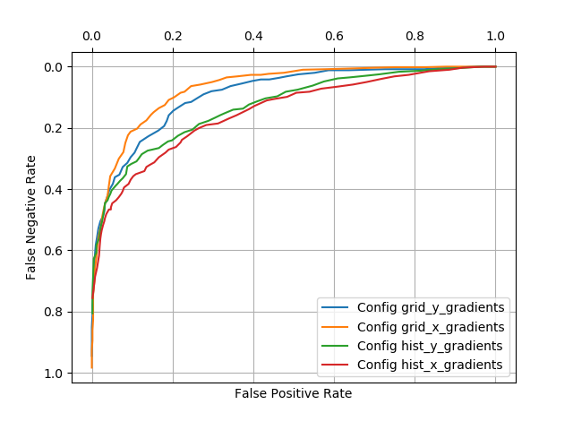

# Homework4. Problem 1 Random Forests

## Jae Dong Hwang

### Computer Vision Features

#### For this assignment add 4 new feature sets to Assignment5Support.Featurize (Notice that the code is split so you'll need to duplicate your features for the training set vs the test set). Build a model with random forests tune the parameters (Try at least 3 settings each of: min to split, num trees and feature restriction). 

##### 0.5 Point -- Divide the image into a 3 x 3 grid and for each grid location include a feature for the min, max, average y-gradient among the locations in the grid. What test-set accuracy did you achieve? What parameter values were best?

##### 0.5 Point -- Divide the image into a 3 x 3 grid and for each grid location include a feature for the min, max, average x-gradient among the locations in the grid. What test-set accuracy did you achieve? What parameter values were best?

##### 0.5 Point -- Implement a histogram of gradients across the whole image (not on the grid) with 5 uniformly spaced bins for the absolute value of the y gradients (0 - 0.2, 0.2 - 0.4, etc). For each bin create a feature whose value is the percent of y-gradients that fall in the bin. What test-set accuracy did you achieve? What parameter values were best?

##### 0.5 Point -- Implement a histogram of gradients across the whole image (not on the grid) with 5 uniformly spaced bins for the absolute value of the x gradients (0 - 0.2, 0.2 - 0.4, etc). For each bin create a feature whose value is the percent of x-gradients that fall in the bin. What test-set accuracy did you achieve? What parameter values were best?

I ran three type of paramter sweeps: minToSplit, numTrees, and feature restriction. I compared the best configuration of each sweeps and got the results below. The number of trees dominated the accuracy improvement. For histograms, I used the five bins, [0 - 0.2, 0.2 - 0.4, 0.4 - 0.6, 0.6 - 0.8, 0.8 - 1].

* Accuracies and Parameters Selected
  * 3x3 grid + y gradients
    * Best Accuracy: 0.8193069306930693 (Param Sweep with numTrees ([20, 40, 60, 80]))
    * min_to_split: 20
    * bagging_w_replacement: True
    * num_trees: 60
    * feature_restriction: 100
      * Statistics: 

      |          |    1     |    0     |
      |----------|----------|----------|
      |    1     | (TP) 482 | (FN) 116 |
      |    0     | (FP) 103 | (TN) 511 |
      Accuracy: 0.8193069306930693
      Precision: 0.8239316239316239
      Recall: 0.8060200668896321
      FPR: 0.16775244299674266
      FNR: 0.1939799331103679
  * 3x3 grid + x gradients
    * Best Accuracy: 0.8448844884488449 (Param Sweep with numTrees ([20, 40, 60, 80]))
    * min_to_split: 20
    * bagging_w_replacement: True
    * num_trees: 40
    * feature_restriction: 100
      * Statistics: 

      |          |    1     |    0     |
      |----------|----------|----------|
      |    1     | (TP) 498 | (FN) 100 |
      |    0     | (FP) 88  | (TN) 526 |
      Accuracy: 0.8448844884488449
      Precision: 0.8498293515358362
      Recall: 0.8327759197324415
      FPR: 0.14332247557003258
      FNR: 0.16722408026755853
  * Histogram of a image y-gradients
    * Best Accuracy: 0.8061056105610561 (Param Sweep with numTrees ([20, 40, 60, 80]))
    * min_to_split: 20
    * bagging_w_replacement: True
    * num_trees: 60
    * feature_restriction: 100
      * Statistics: 

      |          |    1     |    0     |
      |----------|----------|----------|
      |    1     | (TP) 447 | (FN) 151 |
      |    0     | (FP) 84  | (TN) 530 |
      Accuracy: 0.8061056105610561
      Precision: 0.8418079096045198
      Recall: 0.7474916387959866
      FPR: 0.13680781758957655
      FNR: 0.2525083612040134
  * Histogram of a image y-gradients
    * Best Accuracy: 0.7904290429042904 (Param Sweep with numTrees ([20, 40, 60, 80]))
    * min_to_split: 20
    * bagging_w_replacement: True
    * num_trees: 80
    * feature_restriction: 100
      * Statistics: 

      |          |    1     |    0     |
      |----------|----------|----------|
      |    1     | (TP) 427 | (FN) 171 |
      |    0     | (FP) 83  | (TN) 531 |
      Accuracy: 0.7904290429042904
      Precision: 0.8372549019607843
      Recall: 0.7140468227424749
      FPR: 0.13517915309446255
      FNR: 0.28595317725752506

##### 1 Point -- Produce an ROC curve with one curve for: the y-gradients on the 3x3 grid; the x-gradients on the 3x3 grid; the y-gradient histogram; the x-gradient histogram. Use the tuning values you found in the previous parts of this assignment.

```python
config = {'min_to_split': 2,
          'bagging_w_replacement': True,
          'num_trees': 40,
          'feature_restriction': 100}  # use all
```

