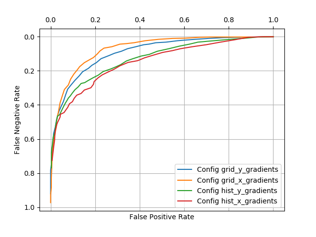

# Homework4. Problem 1 Random Forests

## Jae Dong Hwang

### Computer Vision Features

#### For this assignment add 4 new feature sets to Assignment5Support.Featurize (Notice that the code is split so you'll need to duplicate your features for the training set vs the test set). Build a model with random forests tune the parameters (Try at least 3 settings each of: min to split, num trees and feature restriction). 

##### 0.5 Point -- Divide the image into a 3 x 3 grid and for each grid location include a feature for the min, max, average y-gradient among the locations in the grid. What test-set accuracy did you achieve? What parameter values were best?

##### 0.5 Point -- Divide the image into a 3 x 3 grid and for each grid location include a feature for the min, max, average x-gradient among the locations in the grid. What test-set accuracy did you achieve? What parameter values were best?

##### 0.5 Point -- Implement a histogram of gradients across the whole image (not on the grid) with 5 uniformly spaced bins for the absolute value of the y gradients (0 - 0.2, 0.2 - 0.4, etc). For each bin create a feature whose value is the percent of y-gradients that fall in the bin. What test-set accuracy did you achieve? What parameter values were best?

##### 0.5 Point -- Implement a histogram of gradients across the whole image (not on the grid) with 5 uniformly spaced bins for the absolute value of the x gradients (0 - 0.2, 0.2 - 0.4, etc). For each bin create a feature whose value is the percent of x-gradients that fall in the bin. What test-set accuracy did you achieve? What parameter values were best?

##### 1 Point -- Produce an ROC curve with one curve for: the y-gradients on the 3x3 grid; the x-gradients on the 3x3 grid; the y-gradient histogram; the x-gradient histogram. Use the tuning values you found in the previous parts of this assignment.

```python
config = {'min_to_split': 2,
          'bagging_w_replacement': True,
          'num_trees': 60,
          'feature_restriction': 20}
```
