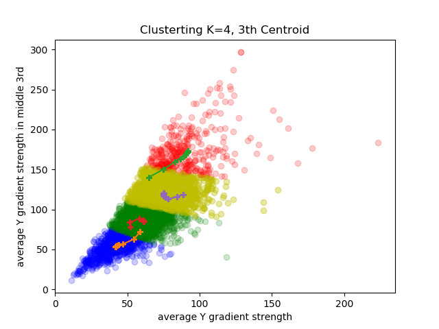
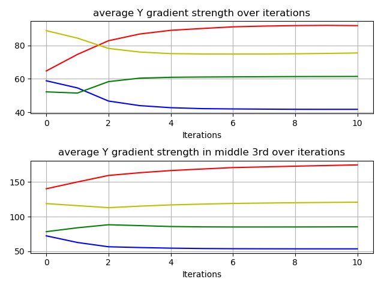

# Homework5. Problem 2. K-mean Clustering

## Jae Dong Hwang

### K-mean Clustering

#### Run a clustering on the training set of the eye blink dataset with the two features provided in the support code (avg y gradient, and avg y gradient mid image). Use 4 clusters for 10 iterations.

#### Produce a plot showing the training data and overlaying the paths the cluster centroids take for each of the 10 iterations.

| | |
|-|-|
| .png)| .png)| 
|.png)| .png)|

#### Find the closest training sample to the final location of each cluster center and the associated image.

The centroid and the closet sample of each cluster are listed here. They are visualized below graph in **black* lines.
* Centroid: [41.78014019454241,53.68187548962004] - Sample [41.845486111111114,52.901041666666664]
* Centroid: [91.76830476309645,174.5258383383384] - Sample [89.61631944444444,174.60416666666666]
* Centroid: [61.41447243250806,85.39088410237919] - Sample [60.989583333333336,85.93229166666667]
* Centroid: [75.44001842270298,120.85180013327052] - Sample [75.30902777777777,121.36458333333333]

| | |
|-|-|
|.png)|.png)|
|.png)|.png)|

#### In no more than 150 words describe the clustering process. Did the clustering converge? Do the images closest to the cluster centers make sense?

The process initially picked four random samples as the centroid of four clusters. Each sample measures the distances from four centroids and selects the closest one to belong. Once the iteration finished, each centroid updates their position to the average of sample points belongs. Repeats N iterations. In this assignment, four centroids moved around until seven iterations and reached the average location of all samples. The below graph shows the values become steady after seven iterations.

***
