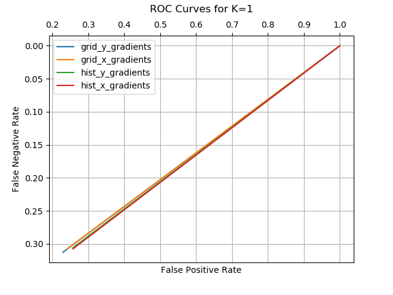
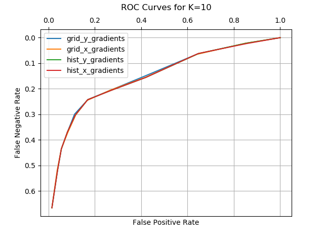

# Homework5. Problem3 K-Nearest Neighbor

## Jae Dong Hwang

### K-Nearest Neighbors

#### Implement k nearest neighbors where each test sample is classified based on its k nearest neighbors among the training set; the test sample's score is the proportion of the k neighbors whose label is 1.

#### Use the features you implemented in the previous assignment (3x3 grid of x-gradient & y-gradient and histograms across the whole image).

##### Evaluate k in [1,3,5,10,20,50,100]. Produce an ROC curve comparing each of these approaches.


* ROC Curve Comparison among Feature Selections (Constant K)

|||
|:-:|:-:|
|||
|||
|| empty |


* ROC Curve Comparision by Feature Selection with various Ks

|||
|-|-|
|||


##### In no more than 100 words describe the results. Which k is best?

In the first section, I compared the ROC curves among feature selection aproaches every K value. As searching more neighbors the Area Under Curve (AUC) increases as expected until K=50. And it's little bit hard to say the benefits of increasing K more than 50. 

In the second sction, I compared the ROC curves varing K values. As shown, the results are very similar between graphs(features selected). 

```python
    # configuration used in featurization
    config0 = {'name': 'grid_y_gradients',
               'grid_y_gradients': True,     # only grid_y_gradient enabled
               'grid_x_gradients': False,
               'hist_y_gradients': False,
               'hist_x_gradients': False}
    config1 = {'name': 'grid_x_gradients',
               'grid_y_gradients': False,
               'grid_x_gradients': True,     # only grid_x_gradient enabled
               'hist_y_gradients': False,
               'hist_x_gradients': False}
    config2 = {'name': 'hist_y_gradients',
               'grid_y_gradients': False,
               'grid_x_gradients': False,
               'hist_y_gradients': True,     # only hist_y_gradients enabled
               'hist_x_gradients': False}
    config3 = {'name': 'hist_x_gradients',
               'grid_y_gradients': False,
               'grid_x_gradients': False,
               'hist_y_gradients': False,
               'hist_x_gradients': True}     # only hist_x_gradients enabled
```

The data indicates that more neighbor search gives better performance while K=50 and K=100 are very comparable. It indicates there is a reasonable thresholds to use to increase the performance of this instance based model.

***