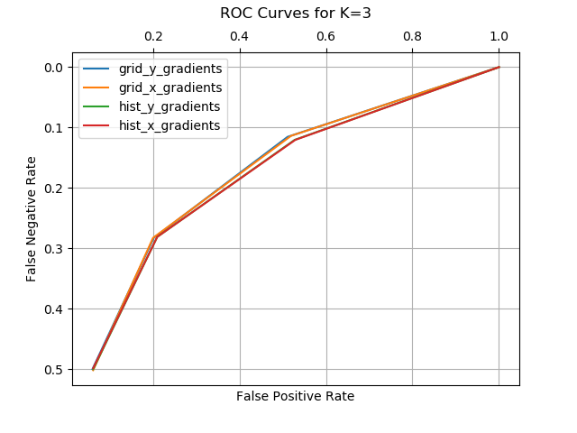
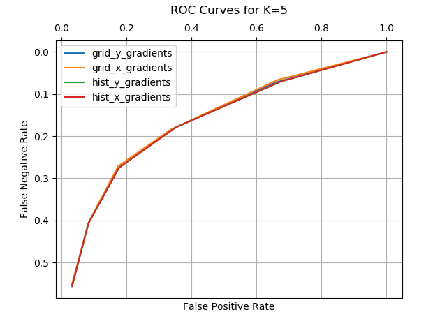
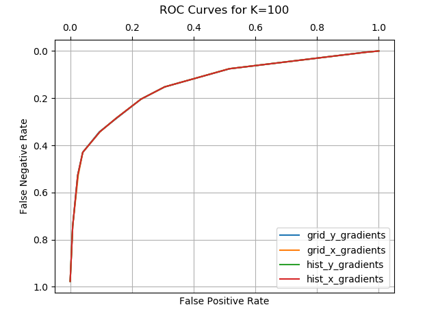

# Homework5. Problem3 K-Nearest Neighbor

## Jae Dong Hwang

### K-Nearest Neighbors

#### Implement k nearest neighbors where each test sample is classified based on its k nearest neighbors among the training set; the test sample's score is the proportion of the k neighbors whose label is 1.

#### Use the features you implemented in the previous assignment (3x3 grid of x-gradient & y-gradient and histograms across the whole image).

#### Evaluate k in [1,3,5,10,20,50,100]. Produce an ROC curve comparing each of these approaches.

#### In no more than 100 words describe the results. Which k is best?

##### ROC Curve Comparison among Feature Selections 

|||
|:-:|:-:|
|||
|||
|| empty |

##### ROC Curve Comparision with various Ks

|||
|-|-|
|||