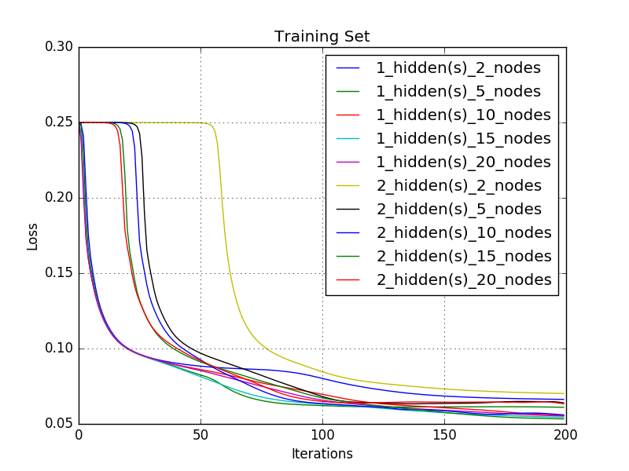

# Homework 6. Problem 1. NeuralNetworks

## Jae Dong Hwang

### NeuralNetworks

Implement learning of fully connected neural networks with an input layer, N hidden layers (and M nodes per hidden layer), and an output layer (with one output variable) using the Backpropagation algorithm as described in Mitchell with stochastic gradient descent.

Train models with every combination of hidden layer in [1, 2] and hidden nodes per layer in [ 2, 5, 10, 15, 20 ]. For each, use 200 iterations with step size=0.05. NOTE: This will take a while to complete, you might want to verify all your parameters are working on smaller experiments before kicking off the full run.

Produce a plot with one line for each of these run with the iteration number on the x axis and training set loss on the y axis. This loss is similar to your logistic regression assignment, but we used a slight variation for our Neural Network (Equation 4.2 in Mitchell). E() = 1/2 sum_sample (y^-y)^2 Produce a separate plot with one line for each of these runs but with the test set losses on the y axis

Next take the model with 1 hidden layer and 2 nodes in that layer. Visualize the weights for each of the hidden nodes. There should be 12*12 weights (plus one for the bias, ignore it). Convert them to a 12 x 12 image where each pixel intensity is ~ 255 * abs(weight).

Note: the VisualizeWeights function in Assignment5Support can do this for you.

Hand in a writeup including:

    1 Point -- the two charts (all your training runs showing the train and test loss)
    1 Point -- the two visualizations (the weights for two hidden nodes)
    1 Point -- the best parameters and test-set accuracy you found in your parameter sweep
    And in no more than 150 words (and 1 more chart / figure if it will help) answer these questions:
        1 Point -- Did you observe overfitting and underfitting? Where?
        1 Point -- What do the visualizations mean?

***

| | |
|-|-|

| Iterations |weights_node0_of_2_in_1_layer |weights_node1_of_2_in_1_layer |
|:-:|-|-|
|50 | |  |
|200 | |  |

* Best Accuracy With 2 layers with 15 nodes

* Statistics: 

|     | 1        | 0        |
| --- | -------- | -------- |
| 1   | (TP) 546 | (FN) 52  |
| 0   | (FP) 37  | (TN) 577 |
Accuracy: 0.9265676567656765
Precision: 0.9365351629502573
Recall: 0.9130434782608695
FPR: 0.06026058631921824
FNR: 0.08695652173913043

Overall acuracy graph - 
| Accuracy with Best Paramters | Overall Accuracies |
|-|-|
| | |

***