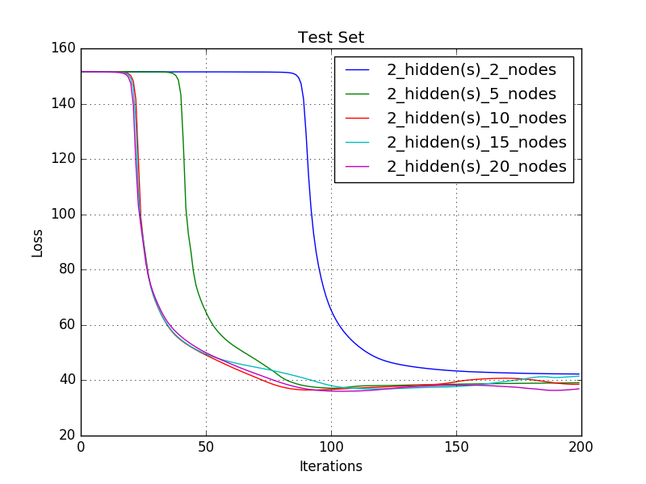
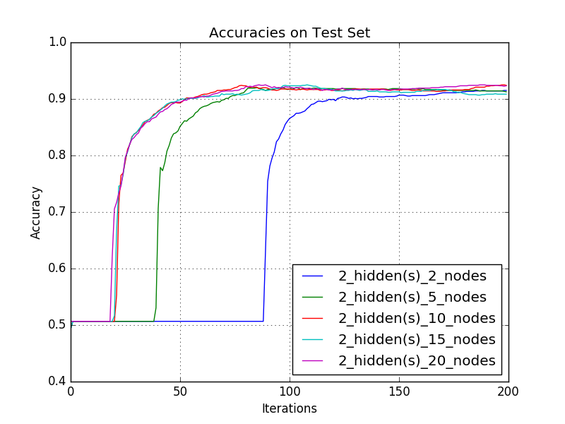

# Homework 6. Problem 1. NeuralNetworks

## Jae Dong Hwang

### NeuralNetworks

#### Hand in a writeup including:

    1 Point -- the two charts (all your training runs showing the train and test loss)
    1 Point -- the two visualizations (the weights for two hidden nodes)
    1 Point -- the best parameters and test-set accuracy you found in your parameter sweep
    And in no more than 150 words (and 1 more chart / figure if it will help) answer these questions:
        1 Point -- Did you observe overfitting and underfitting? Where?
        1 Point -- What do the visualizations mean?

***

The loss results from training and test set show similar gradient descent behavior overall. In 2 hidden layer cases, during early gradient descent steps, the network represents almost linear in both data set. And more nodes help the model to accelerate the learning rate (dropping loss rate), but it causes the overfitting as each weight looks for their local minimum values. I also noticed the model produced slightly higher learning rate on the test set, but in general, the network produced similar loss results.  

|# of Layers | Loss in Training Set | Loss in Test Set |
|:-:|-|-|
|1| | |
|2| | |

For one layer with two nodes case, I produced the images of two nodes at iteration 50 and 200. The picture in the third column helps to locate the pixels where the values between two nodes are different.

| Iterations |weights_node0_of_2_in_1_layer |weights_node1_of_2_in_1_layer | abs(weight delta) between nodes |
|:-:|-|-|-|
|50 | |  |  |
|200 | |  |  |

Parameter sweep identified the best accuracy, 0.927, with 12 layers and 15 nodes in 200 iterations.

* Best Accuracy With 2 layers with 15 nodes (during 200 iterations)

* Statistics: 

|     | 1        | 0        |
| --- | -------- | -------- |
| 1   | (TP) 546 | (FN) 52  |
| 0   | (FP) 37  | (TN) 577 |
Accuracy: 0.9265676567656765
Precision: 0.9365351629502573
Recall: 0.9130434782608695
FPR: 0.06026058631921824
FNR: 0.08695652173913043

The accuracy graph from the network with two hidden layers indicates the network is underfitting data during the early stage of gradient descents. And it behaviors the overfitting once 145 weights start fighting each other for their local minimum values.

| Accuracy with Best Paramters | Overall Accuracies |
|-|-|
| | |

***