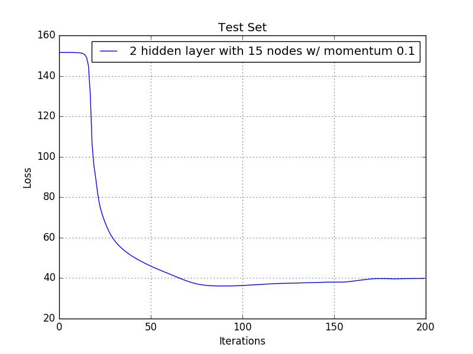
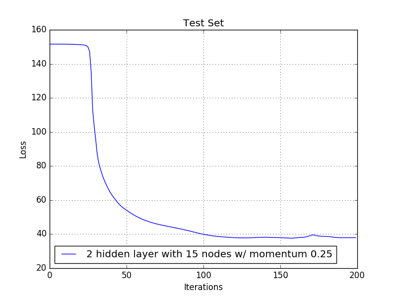
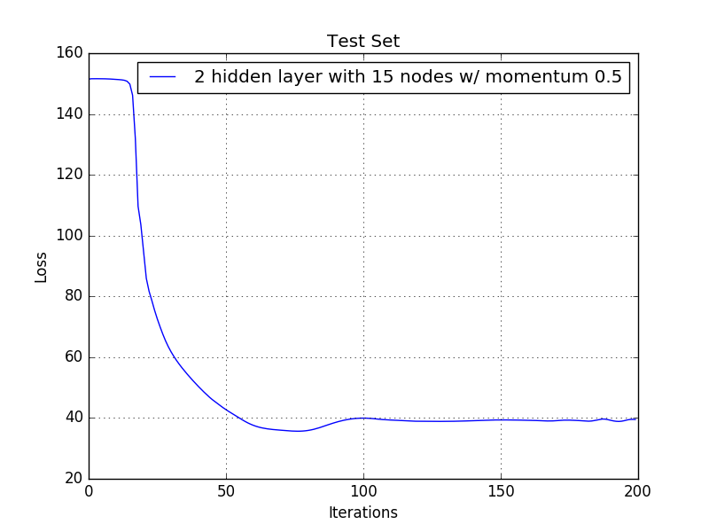
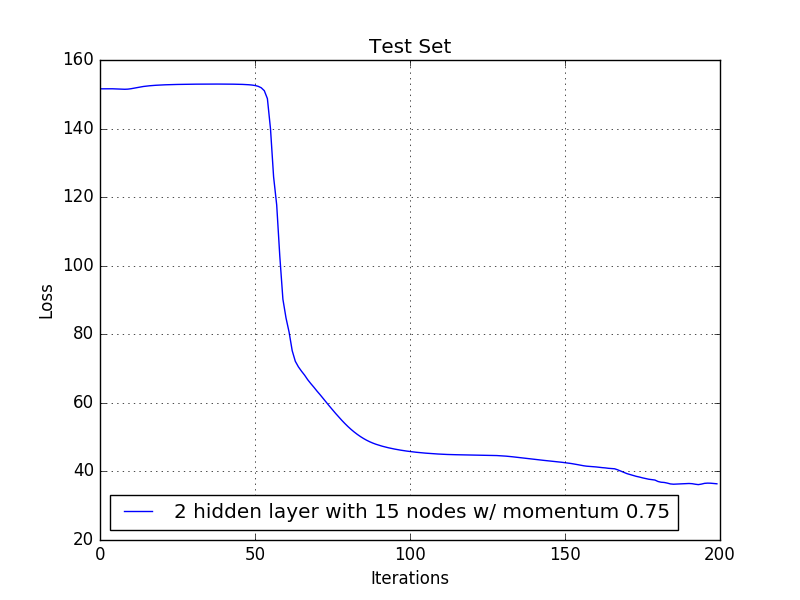

# Homework 6. Eye Blink Model

## Jae Dong Hwang

### Eye Blink Model

Now tune neural networks to produce the best model you can.

Use just the training data to tune your parameters (cross validation or a hold-out set); reserve the test set for final accuracy measurement.

1 Point -- Change the features in at least one way [ increase or decrease the image scaling provided by the sample, change normalization, or add momentum to your back propagation. ]. Include a table showing the results and a few sentences describing if and how it helped.

1 Point -- Use 2-3 tables and not more than 200 words to describe the parameter tuning you did. Describe one place where you examined the output of the modeling process and used the insight to improve your modeling process. What was this output? What change did you make because of it?

1 Point -- Include an ROC curve comparing the best random forest model you got on hand-crafted features (last assignment); your initial Neural Network (before any tuning); and your final resulting network.

1 Point -- In no more than 300 words describe the process, which model is best, why, and what you think could improve your results further.

***

#### Solution

I took four approaches to tune the model; 1) image size, 2) normalization, 3) step size($\eta$), and 3) momentum in Mitchell (4.18). But only a certain step size and momentum parameter cases produced better performance from learning speed and/or accuracies. In the case of image scaling and change normalization didn't really improve accuracy. 
|0.0|


##### Changing Image Scale by 4 (to 6 x 6)

* Statistics:

|     | 1        | 0        |
| --- | -------- | -------- |
| 1   | (TP) 488 | (FN) 110 |
| 0   | (FP) 107 | (TN) 507 |
Accuracy: 0.820957095709571
|0.0|


Precision: 0.8201680672268907
Recall: 0.8160535117056856
FPR: 0.1742671009771987
FNR: 0.18394648829431437

##### Chaning Normalization

| Factors | 133 | 255 | 510 |
|:-:|:-:|:-:|:-:|
| Accuracies |0.9166666666666666 |0.9133663366336634 | 0.9051155115511551|

##### Tunning step size change

After many trials on parameter sweeps with a results shown above(not so impressive results), I examinened output data and graphs and noticed the there is a initial period where loss function doesn't decrease. I thought it is related to learning rate ($\eta$). I tunned step size and got accuracy results below. What interesting to me was the step size with 0.08 (agressive learning rate) took more time to accually start dropping (visiable) loss. And also the loss function ($\eta=0.08$) fluctuated after 120 iterations. I think the learning rate is little too high to our data.

| Step Size |  0.05 | 0.08 |
|:--:|:-:|:-:|
|Accuracies | 0.9224422442244224| 0.9257425742574258|
| Loss | | |

##### Adding Momentum

Once model is implemented and I added momentum in Mitchell (4.18). I expected to see higher loss rate and even slightly higher accuracies in general.

| Momentum | Accuracy at 200 iteration<br/>(Highest Accuracy) | Loss |
|:-:|:-:|:-:|:-:|
|0.1|0.9117161716171617<br/>(0.9249174917491749)||
|0.25|0.9183168316831684<br/>(0.9249174917491749)||
|0.5|0.9166666666666666<br/>(0.9298679867986799)||
|0.75|0.9207920792079208<br/>(0.9257425742574258)||


#### ROC Curve Comparison

For ROC curve comparsion, I used the following parameters, which was aggregated from previous homework.

```python
    config = {'min_to_split': 2,
              'bagging_w_replacement': True,
              'num_trees': 40,
              'feature_restriction': 0,   # all features
              'num_hidden_layer' : 2,
              'num_nodes' : 15,
              'step_size' : 0.08,
              'iterations' : 200}

```


As shown above, I got the better results from neural network model. 300 words....

***

### Appendix

#### A. Data Logging for Parameter Sweeps

##### 1. Changing Normalization

| Factors | 133 | 255 | 510 |
|:-:|:-:|:-:|:-:|
| Accuracies |0.9166666666666666 |0.9133663366336634 | 0.9051155115511551|

###### a. norm_factor = 133

* Statistics:

|     | 1        | 0        |
| --- | -------- | -------- |
| 1   | (TP) 533 | (FN) 65  |
| 0   | (FP) 36  | (TN) 578 |
Accuracy: 0.9166666666666666
Precision: 0.9367311072056239
Recall: 0.8913043478260869
FPR: 0.05863192182410423
FNR: 0.10869565217391304

###### b. norm_factor = 255

* Statistics:

|     | 1        | 0        |
| --- | -------- | -------- |
| 1   | (TP) 515 | (FN) 83  |
| 0   | (FP) 22  | (TN) 592 |
Accuracy: 0.9133663366336634
Precision: 0.9590316573556797
Recall: 0.8612040133779264
FPR: 0.035830618892508145
FNR: 0.13879598662207357

###### c. norm_factor = 510

* Statistics:

|     | 1        | 0        |
| --- | -------- | -------- |
| 1   | (TP) 548 | (FN) 50  |
| 0   | (FP) 65  | (TN) 549 |
Accuracy: 0.9051155115511551
Precision: 0.8939641109298532
Recall: 0.9163879598662207
FPR: 0.10586319218241043
FNR: 0.08361204013377926

##### 2. Changing Step Size

###### a. Step Size = 0.05

* Statistics:

|     | 1        | 0        |
| --- | -------- | -------- |
| 1   | (TP) 526 | (FN) 72  |
| 0   | (FP) 22  | (TN) 592 |
Accuracy: 0.9224422442244224
Precision: 0.9598540145985401
Recall: 0.8795986622073578
FPR: 0.035830618892508145
FNR: 0.12040133779264214

###### b. Step Size = 0.08

* Statistics:

|     | 1        | 0        |
| --- | -------- | -------- |
| 1   | (TP) 550 | (FN) 48  |
| 0   | (FP) 42  | (TN) 572 |
Accuracy: 0.9257425742574258
Precision: 0.9290540540540541
Recall: 0.919732441471572
FPR: 0.06840390879478828
FNR: 0.0802675585284281


##### 3. Adding (weight) Momentums

###### a. Momentum = 0.0 (no momentum)

Best Accuracy at 83 / 200 iterations
* Statistics:

|          |    1     |    0     |
|----------|----------|----------|
|    1     | (TP) 561 | (FN) 37  |
|    0     | (FP) 54  | (TN) 560 |
Accuracy: 0.9249174917491749
Precision: 0.9121951219512195
Recall: 0.9381270903010034
FPR: 0.08794788273615635
FNR: 0.061872909698996656
* Statistics:

|          |    1     |    0     |
|----------|----------|----------|
|    1     | (TP) 526 | (FN) 72  |
|    0     | (FP) 22  | (TN) 592 |
Accuracy: 0.9224422442244224
Precision: 0.9598540145985401
Recall: 0.8795986622073578
FPR: 0.035830618892508145
FNR: 0.12040133779264214

###### a. Momentum = 0.1

Best Accuracy at 78 / 200 iterations
* Statistics:

|          |    1     |    0     |
|----------|----------|----------|
|    1     | (TP) 556 | (FN) 42  |
|    0     | (FP) 49  | (TN) 565 |
Accuracy: 0.9249174917491749
Precision: 0.9190082644628099
Recall: 0.9297658862876255
FPR: 0.07980456026058631
FNR: 0.07023411371237458
* Statistics:

|          |    1     |    0     |
|----------|----------|----------|
|    1     | (TP) 521 | (FN) 77  |
|    0     | (FP) 30  | (TN) 584 |
Accuracy: 0.9117161716171617
Precision: 0.9455535390199638
Recall: 0.8712374581939799
FPR: 0.048859934853420196
FNR: 0.12876254180602006

###### b. Momentum = 0.25

Best Accuracy at 110 / 200 iterations
* Statistics:

|          |    1     |    0     |
|----------|----------|----------|
|    1     | (TP) 555 | (FN) 43  |
|    0     | (FP) 48  | (TN) 566 |
Accuracy: 0.9249174917491749
Precision: 0.9203980099502488
Recall: 0.9280936454849499
FPR: 0.0781758957654723
FNR: 0.07190635451505016
* Statistics:

|          |    1     |    0     |
|----------|----------|----------|
|    1     | (TP) 523 | (FN) 75  |
|    0     | (FP) 24  | (TN) 590 |
Accuracy: 0.9183168316831684
Precision: 0.9561243144424132
Recall: 0.8745819397993311
FPR: 0.03908794788273615
FNR: 0.1254180602006689

###### c. Momentum = 0.5

Best Accuracy at 71 / 200 iterations
* Statistics:

|          |    1     |    0     |
|----------|----------|----------|
|    1     | (TP) 553 | (FN) 45  |
|    0     | (FP) 40  | (TN) 574 |
Accuracy: 0.9298679867986799
Precision: 0.9325463743676222
Recall: 0.9247491638795987
FPR: 0.06514657980456026
FNR: 0.07525083612040134
* Statistics:

|          |    1     |    0     |
|----------|----------|----------|
|    1     | (TP) 525 | (FN) 73  |
|    0     | (FP) 28  | (TN) 586 |
Accuracy: 0.9166666666666666
Precision: 0.9493670886075949
Recall: 0.8779264214046822
FPR: 0.04560260586319218
FNR: 0.12207357859531773

###### d. Momentum = 0.75

Best Accuracy at 187 / 200 iterations
* Statistics:

|          |    1     |    0     |
|----------|----------|----------|
|    1     | (TP) 548 | (FN) 50  |
|    0     | (FP) 40  | (TN) 574 |
Accuracy: 0.9257425742574258
Precision: 0.9319727891156463
Recall: 0.9163879598662207
FPR: 0.06514657980456026
FNR: 0.08361204013377926
* Statistics:

|          |    1     |    0     |
|----------|----------|----------|
|    1     | (TP) 546 | (FN) 52  |
|    0     | (FP) 44  | (TN) 570 |
Accuracy: 0.9207920792079208
Precision: 0.9254237288135593
Recall: 0.9130434782608695
FPR: 0.07166123778501629
FNR: 0.08695652173913043

***
