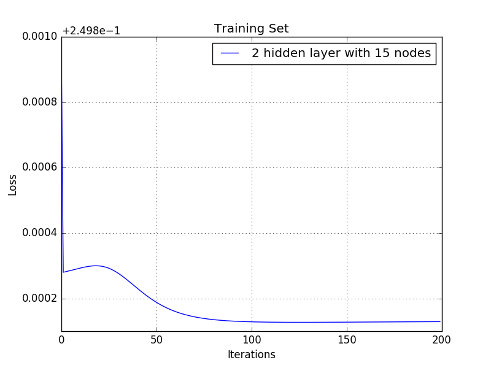

# Homework 6. Eye Blink Model

## Jae Dong Hwang

### Eye Blink Model

Now tune neural networks to produce the best model you can.

Use just the training data to tune your parameters (cross validation or a hold-out set); reserve the test set for final accuracy measurement.

1 Point -- Change the features in at least one way [ increase or decrease the image scaling provided by the sample, change normalization, or add momentum to your back propagation. ]. Include a table showing the results and a few sentences describing if and how it helped.

1 Point -- Use 2-3 tables and not more than 200 words to describe the parameter tuning you did. Describe one place where you examined the output of the modeling process and used the insight to improve your modeling process. What was this output? What change did you make because of it?

1 Point -- Include an ROC curve comparing the best random forest model you got on hand-crafted features (last assignment); your initial Neural Network (before any tuning); and your final resulting network.

1 Point -- In no more than 300 words describe the process, which model is best, why, and what you think could improve your results further.

***

