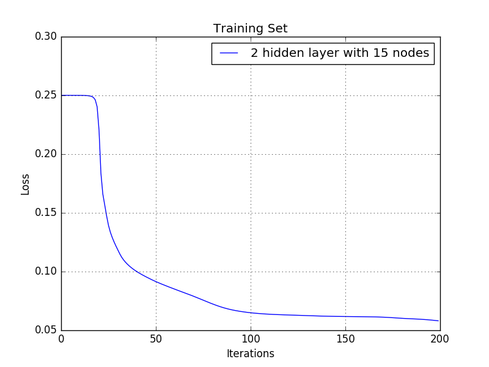
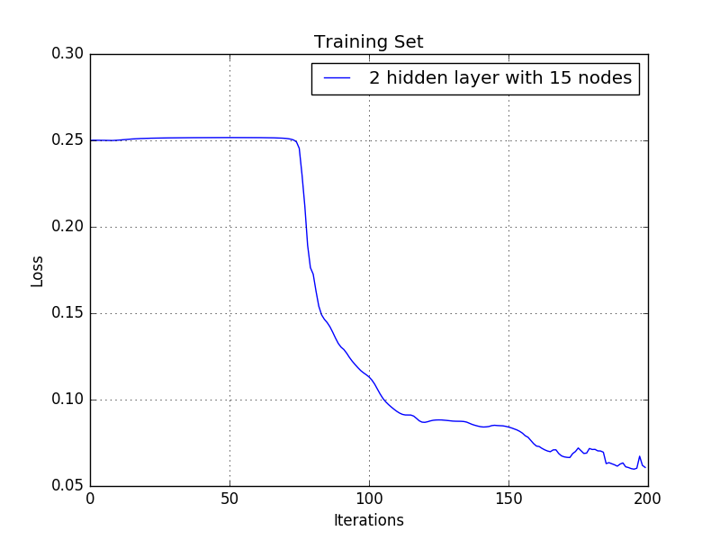
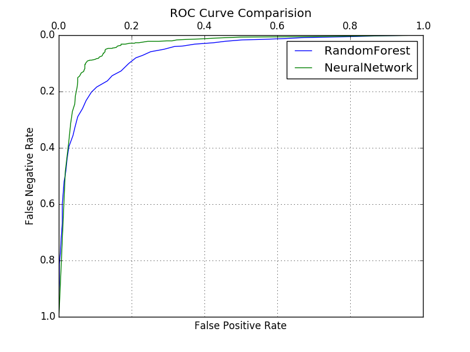

# Homework 6. Eye Blink Model

## Jae Dong Hwang

### Eye Blink Model

Now tune neural networks to produce the best model you can.

Use just the training data to tune your parameters (cross validation or a hold-out set); reserve the test set for final accuracy measurement.

1 Point -- Change the features in at least one way [ increase or decrease the image scaling provided by the sample, change normalization, or add momentum to your back propagation. ]. Include a table showing the results and a few sentences describing if and how it helped.

1 Point -- Use 2-3 tables and not more than 200 words to describe the parameter tuning you did. Describe one place where you examined the output of the modeling process and used the insight to improve your modeling process. What was this output? What change did you make because of it?

1 Point -- Include an ROC curve comparing the best random forest model you got on hand-crafted features (last assignment); your initial Neural Network (before any tuning); and your final resulting network.

1 Point -- In no more than 300 words describe the process, which model is best, why, and what you think could improve your results further.

***
#### Changing Image Scale by 4 (to 6 x 6)

* Statistics: 

|     | 1        | 0        |
| --- | -------- | -------- |
| 1   | (TP) 488 | (FN) 110 |
| 0   | (FP) 107 | (TN) 507 |
Accuracy: 0.820957095709571
Precision: 0.8201680672268907
Recall: 0.8160535117056856
FPR: 0.1742671009771987
FNR: 0.18394648829431437

#### Chaning Normalization

##### norm_factor = 133

* Statistics: 

|     | 1        | 0        |
| --- | -------- | -------- |
| 1   | (TP) 533 | (FN) 65  |
| 0   | (FP) 36  | (TN) 578 |
Accuracy: 0.9166666666666666
Precision: 0.9367311072056239
Recall: 0.8913043478260869
FPR: 0.05863192182410423
FNR: 0.10869565217391304

##### norm_factor = 255

* Statistics: 

|     | 1        | 0        |
| --- | -------- | -------- |
| 1   | (TP) 515 | (FN) 83  |
| 0   | (FP) 22  | (TN) 592 |
Accuracy: 0.9133663366336634
Precision: 0.9590316573556797
Recall: 0.8612040133779264
FPR: 0.035830618892508145
FNR: 0.13879598662207357

##### norm_factor = 510

* Statistics: 

|     | 1        | 0        |
| --- | -------- | -------- |
| 1   | (TP) 548 | (FN) 50  |
| 0   | (FP) 65  | (TN) 549 |
Accuracy: 0.9051155115511551
Precision: 0.8939641109298532
Recall: 0.9163879598662207
FPR: 0.10586319218241043
FNR: 0.08361204013377926

#### Tunning step size change
After many trials on parameter sweeps with a results shown above(not so impressive results), I examinened output data and graphs and noticed the there is a initial period where loss function doesn't decrease. I thought it is related to learning rate ($\eta$). I tunned step size and got accuracy results below. What interesting to me was the step size with 0.08 (agressive learning rate) took more time to accually start dropping (visiable) loss. And also the loss function ($\eta=0.08$) fluctuated after 120 iterations. I think the learning rate is little too high to our data.

| Step Size = 0.05 | Step Size = 0.08 |
|-|-|
| | |

##### Step Size = 0.05

* Statistics: 

|     | 1        | 0        |
| --- | -------- | -------- |
| 1   | (TP) 526 | (FN) 72  |
| 0   | (FP) 22  | (TN) 592 |
Accuracy: 0.9224422442244224
Precision: 0.9598540145985401
Recall: 0.8795986622073578
FPR: 0.035830618892508145
FNR: 0.12040133779264214

##### Step Size = 0.08

* Statistics: 

|     | 1        | 0        |
| --- | -------- | -------- |
| 1   | (TP) 550 | (FN) 48  |
| 0   | (FP) 42  | (TN) 572 |
Accuracy: 0.9257425742574258
Precision: 0.9290540540540541
Recall: 0.919732441471572
FPR: 0.06840390879478828
FNR: 0.0802675585284281

#### ROC Curve Comparison

For ROC curve comparsion, I used the following parameters, which was aggregated from previous homework.

```python
    config = {'min_to_split': 2,
              'bagging_w_replacement': True,
              'num_trees': 40,
              'feature_restriction': 0,   # all features
              'num_hidden_layer' : 2,
              'num_nodes' : 15,
              'step_size' : 0.08,
              'iterations' : 200}

```



As shown above, I got the better results from neural network model. 300 words....

***