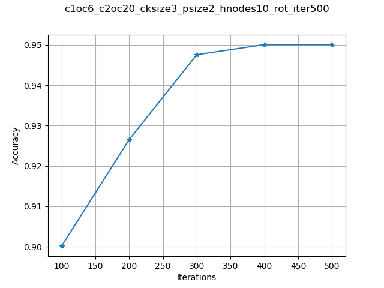
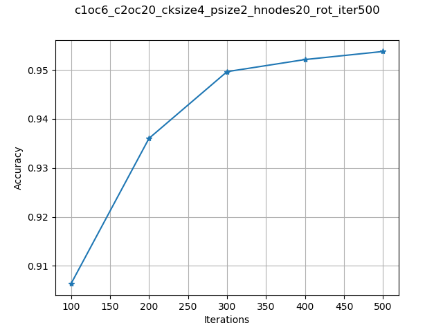
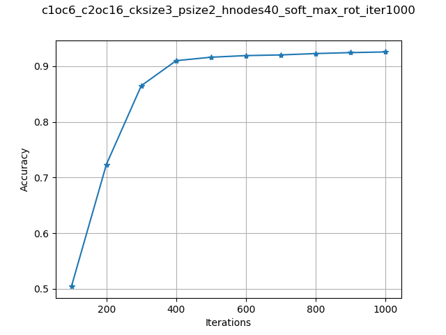
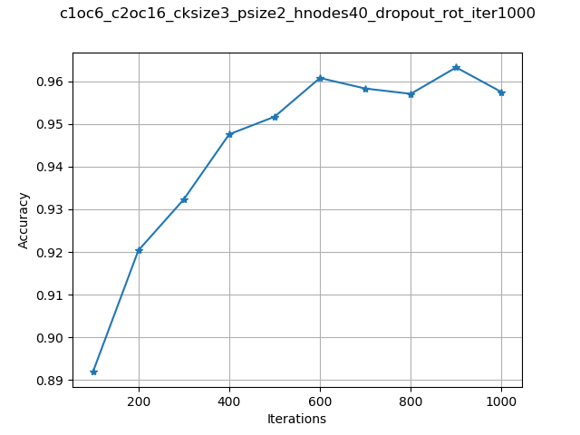
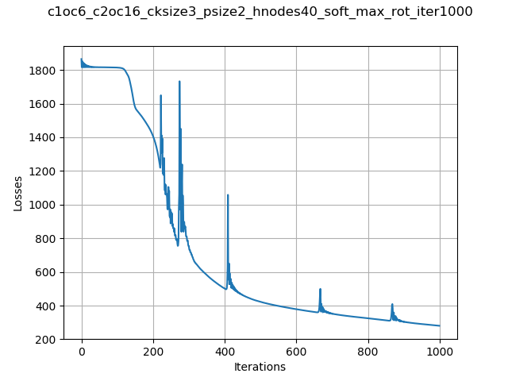
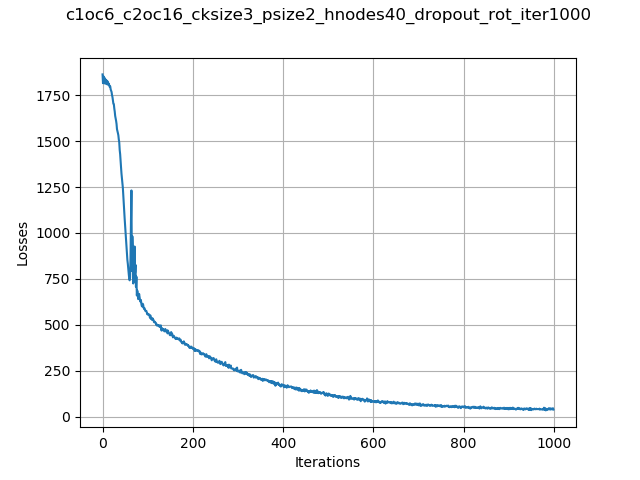
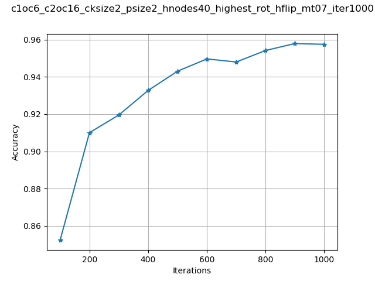
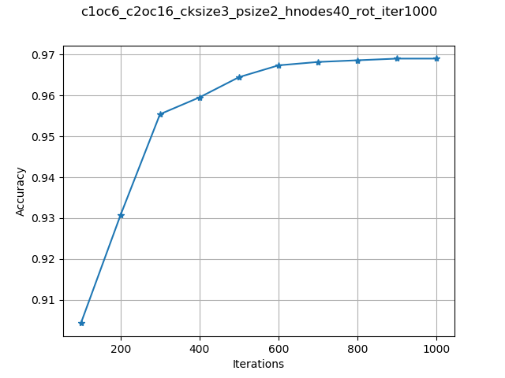
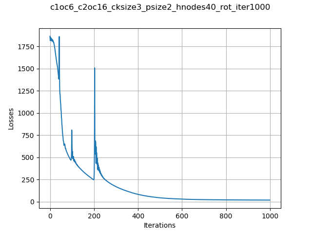

# Homework 8. Neural Network Architecture

## Jae Dong Hwang

### Highest Accuracy Achieved on *Test set* : 96.9%

I began with simple architecture of one convolution and one average sample over 500 iterations. And after trying out several options, such as ReLu, MaxPool2d, Dropout, and Softmax, on the simple architecture, I realized that it's hard to decide on the design to achieve target accuracy; 97%, without parameter sweeps. I ran several pieces of training and selected the list of parameters and update code to run the parameter sweep.

```python
    for iteration in [500, 1000]:
        for conv1_output_channel in [6, 8, 10]:
            for conv2_output_channel in [16, 20, 24, 28]:
                for hiddenNodes in [10, 20, 40, 80]:
                    for conv_kernel_size in [3, 4, 5]:
                        for pooling_size in [2]:
                            # model training etc.
```

And I updated the model to make the model similar to LeNet to begin with and see how high the model can reach. 

* Basically, the model constructor defines the layers in following order: 

  * convolution 1 (3 x 3, 4 x 4, and 5 x 5)
  * 2 x 2 pooling 
  * convolution 2 (3 x 3, 4 x 4, and 5 x 5)
  * 2 x 2 pooling
  * full connection layer(s) (10, 20, 40, and 80 hidden nodes)

* Observation on parameter sweep results

  * Iteration 500 vs. 1000
  The iteration was most outer configuration. The accuracies vary depending on settings. Some case indicates there is still momentum to increase accuracy and others don't. Below table shows the example at 500 iterations. I ran parameter sweeps with 500 iterations and picked the case where there are still momentums to improve.

  | No Learning momenum | Learning momentum |
  |:-:|:-:|
  | | |

  * Activation (Sigmoid vs. ReLU)
    I've observed the sigmoid activation converge more gradually while ReLU makes the convergence little bit sparsely. And since ReLU didn't help to improve accuracy, I used the sigmoid as a default.

  * Number of Down-sampling Layers
    LeNet architecture has two full connected layers. I investigated the results but found that one fully connected one with 40 hidden nodes produces the highest results.

  * Randomness of LeNet 
    Initially, the model wasn't deterministic and produced wide ranges of accuracies given a configuration. So I had to walk around by seeding the random module.

  ```python
    import torch
    # ...
    torch.manual_seed(1)
  ```

   * Data Augmentation
     The model the hard time to hit the about 92.5% accuracy at most. I decided the option to augment input data and use more volume of the training set. I wrote a script that reads all sample files and randomly rotate, flip, add noise to each image and save them in each associated input folder (so that I can use same label; close/open and sides).
    I increase the volume of the training set by augmenting images with three methods; rotation, noise, and flipping.

  * SoftMax2D and Dropout2D
    I also tried both options on top of both convolutions but didn't see the noticeable changes. Dorpout2D showed the randomness as expected but didn't either improve the accuracy or continue the learning momentum above 96% accuracy.

    | SoftMax2D (output: 92.076 %)| Dropout2D (output: highest 96.32 %)|
    |:-:|:-:|
    | | |
    | | |

  * Once I figure the parameters for the best model, I also ran parameter sweep on optimizers. I picked the different momemtums and learning rates but got 95% at highest when running rate is 1e-4 and momemtum is 0.7, which is still lower than the case with momentum, 0.9.
  

* Architecutre of the Best Model
  Given the results of parameter sweeps and studying the options of activations, selections(dropout), normalization(softmax), below architecture configuration provided the highest accuracy on test set including randomly rotated images.

  * convolution 1 - 3 x 3 filters and 6 output channels
  * 2 x 2 max pooling 
  * convolution 2 - 3 x 3 and 16 output channels)
  * 2 x 2 max pooling
  * one full connection layer with 40 hidden nodes
  
  And below is the accuracy and loss graph with 1000 iteration.

| Accuracy | Loss |
|:-:|:-:|
|| |

  * Statistics: 
    * Accuracy: 0.9690466364011556
    * Precision: 0.9683860232945092
    * Recall: 0.9691923397169026
    * FPR: 0.031096563011456628
    * FNR: 0.030807660283097418

***

```python
import torch


class SimpleBlinkNeuralNetwork(torch.nn.Module):

    def __init__(self,
                 conv1_output_channel=6,
                 conv2_output_channel=16,
                 conv_kernel_size=5,
                 pooling_size=2,
                 hiddenNodes=20):

        self.config_name = 'c1oc{}_c2oc{}_cksize{}_psize{}_hnodes{}'\
                            .format(conv1_output_channel,
                                    conv2_output_channel,
                                    conv_kernel_size,
                                    pooling_size,
                                    hiddenNodes)

        super(SimpleBlinkNeuralNetwork, self).__init__()
        # input size = (24, 24)
        self.conv1 = torch.nn.Conv2d(1, conv1_output_channel, conv_kernel_size)
        conv1_out_dim = 24 - conv_kernel_size + 1
        # output size = (20, 20)  # (20 = 24 - 5 + 1)

        # pooling (2, 2) in forward()
        # output size = (10, 10)
        pooling1_out_dim = conv1_out_dim // pooling_size

        # input size = (10, 10),
        self.conv2 = torch.nn.Conv2d(conv1_output_channel, conv2_output_channel, conv_kernel_size)
        conv2_out_dim = pooling1_out_dim - conv_kernel_size + 1
        # output size = (6, 6)  # (6 = 10 - 5 + 1)

        # pooling (2, 2) in forward()
        # output size = (3, 3)
        pooling2_out_dim = conv2_out_dim // pooling_size

        self.fc1 = torch.nn.Sequential(
            torch.nn.Linear(conv2_output_channel * pooling2_out_dim**2, hiddenNodes),
            torch.nn.Sigmoid()
        )

        # Note: this layer is disabled for highest accuracy.
        self.fc2 = torch.nn.Sequential(
            torch.nn.Linear(hiddenNodes, 10),
            torch.nn.Sigmoid()
        )
        
        self.fc3 = torch.nn.Sequential(
            torch.nn.Linear(10, 1),
            torch.nn.Sigmoid()
        )

    def forward(self, x):
        # dropout = torch.nnnDropout2d(p=0.2) # didn't increase accuracy
        x = torch.nn.functional.max_pool2d(self.conv1(x), (2, 2), stride=2)
        x = torch.nn.Softmax2d()(x)  # didn't increase accuracy
        x = torch.nn.functional.max_pool2d(self.conv2(x), (2, 2), stride=2)
        x = x.reshape(x.size(0), -1)
        x = self.fc1(x)
        x = self.fc2(x)
        x = self.fc3(x)
        return x
```

***