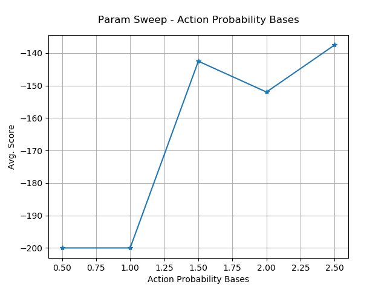
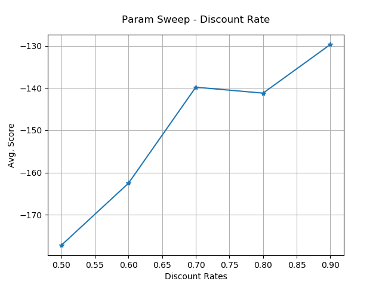
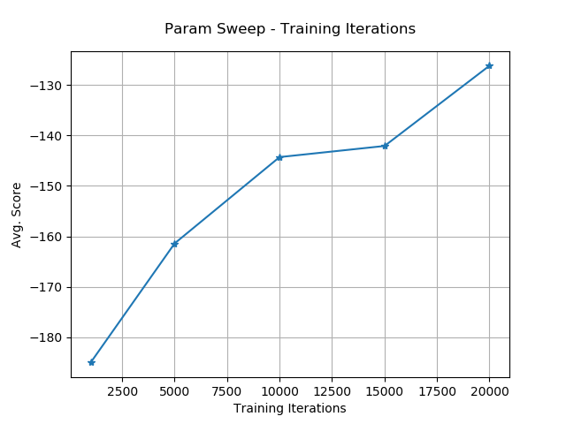
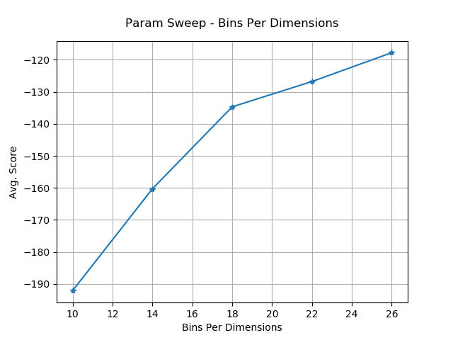
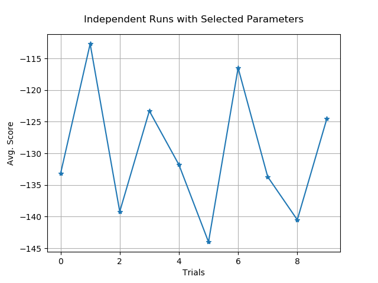

# Homework9. Reinforcement Gym

## Jae Dong Hwang

### QLearningzCartPole

| runNumber | Trial 1 | Trial 2 | Trial 3 | Trial 4 | Trial 5 | Trial 6 | Trial 7 | Trial 8 | Trial 9 | Trial 10 |
|:-:|:-:|:-:|:-:|:-:|:-:|:-:|:-:|:-:|:-:|:-:|
|0|200.0|200.0|200.0|200.0|200.0|200.0|200.0|200.0|200.0|200.0|
|1|200.0|186.0|200.0|200.0|200.0|200.0|200.0|200.0|128.0|200.0|
|2|200.0|200.0|200.0|200.0|200.0|200.0|197.0|200.0|200.0|200.0|
|3|200.0|200.0|200.0|200.0|200.0|189.0|200.0|200.0|200.0|200.0|
|4|200.0|200.0|200.0|200.0|200.0|200.0|200.0|200.0|125.0|200.0|
|5|200.0|200.0|200.0|200.0|200.0|200.0|200.0|200.0|123.0|200.0|
|6|200.0|200.0|200.0|200.0|200.0|200.0|200.0|200.0|168.0|200.0|
|7|200.0|200.0|200.0|200.0|200.0|175.0|200.0|200.0|119.0|200.0|
|8|200.0|200.0|200.0|200.0|200.0|182.0|200.0|200.0|129.0|200.0|
|9|200.0|200.0|200.0|200.0|200.0|200.0|200.0|200.0|200.0|200.0|
| Average |200.0|198.6|200.0|200.0|200.0|194.6|199.7|200.0|159.2|200.0|

### QLearningMountainCar

* Average Score for Parameter Sweeps
  
  I ran the start script with each parameter options and collected the average score.

  ```python
  discountRates = [0.5, 0.6, 0.7, 0.8, 0.9]  
  actionProbabilityBases = [0.5, 1.0, 1.5, 2.0, 2.5] 
  trainingIterations = [1000, 5000, 10000, 15000, 20000]
  BinsPerDimensions = [10, 14, 18, 22, 26]
  ```

  | | |
  |-|-|
  | | |

  * Action Probability Base (k) value less than and equals to 1.0  doesn't improve policy to control the carts. It means it doesn't have high Q values enough to make better the range. Increasing discount rates within chosen range get closer to the optimal action. And training iteration also helped to converge to the optimal control space. Similarly, more state space helped to reach the best results.

* Improved parameter setting:
  Given the results of paramter sweep data, I picked following configuration.

  ```python
  discountRate = 0.9
  actionProbabilityBase = 2.5
  trainingIteration = 20000
  BinsPerDimension = 26
  ```
  And here is the results from running 10 times policy learning.

  
